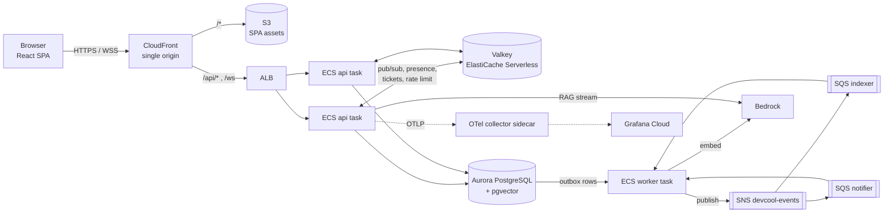
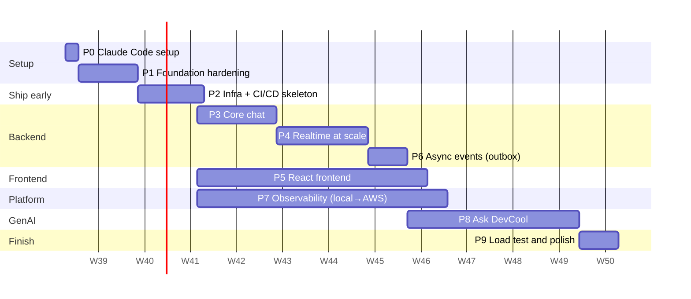
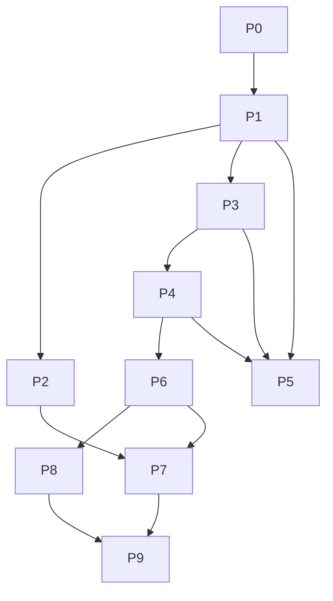

# DevCool — Fullstack Roadmap

This is the plan for taking DevCool from a single-node chat API to a production-shaped fullstack chat system on AWS, with a GenAI feature, in about 12 weeks.

Every phase file is a **sub-plan** with a task checklist. Each task is small enough for one PR. Tick the task in the same PR that implements it; the `SessionStart` hook reads the status table below to remind Claude where you are.

## Where things are

| Folder | What's inside |
|---|---|
| [`architecture/`](architecture/) | Target system design, the tech-stack comparison, the chat system deep dive, and the GenAI/RAG design |
| [`architecture/adr/`](architecture/adr/) | One Architecture Decision Record per significant choice, with the options that were rejected and why |
| [`phases/`](phases/) | Sub-plans P0–P9, in execution order |
| [`claude-code/`](claude-code/) | How this repo uses Claude Code, the concepts behind each mechanism, and interview Q&A |
| [`delivery-playbook.md`](delivery-playbook.md) | How to run the 12 weeks: ownership modes (you vs Claude), the task loop, scope cuts, game days, the $20/month AWS plan, interview readiness, journal templates |

Related, older material (read it, don't duplicate it):
- [`../learning/10-realtime-architecture-design.md`](../learning/10-realtime-architecture-design.md): realtime options A–K. ADR-0006 and Phase 4 build on its §7 Stage 2.
- [`../learning/README.md`](../learning/README.md): the security audit. Phase 1 closes what is still open.
- [`../improvements/lessons.md`](../improvements/lessons.md): review lessons. The `hexagonal-reviewer` agent applies them.

## Target in one picture

## Schedule (12 weeks)

| Week | Phase | Output |
|---|---|---|
| 1 | P0, P1 | Claude Code configured. Schema under Flyway, security holes closed, ITs in CI |
| 2–3 | P2 | The **current** app is deployed to AWS by the pipeline (walking skeleton) |
| 3–4 | P3 | Edit/delete, receipts, unread counts, idempotent send, per-channel ordering |
| 3–8 | P5 | React SPA grows alongside the backend |
| 3 → 7 | P7 | Local LGTM from week 3; Grafana Cloud dashboards and alerts by week 7 |
| 4–6 | P4 | Multi-node WebSocket: backplane, presence, typing, resume, graceful drain |
| 6 | P6 | Transactional outbox → SNS → SQS with idempotent consumers |
| 8–11 | P8 | Indexing → semantic search → RAG streaming → hardening → extras |
| 12 | P9 | k6 load test report, chaos test, README, CV bullets |

### Milestones

| Id | Week | Demo |
|---|---|---|
| M1 | 3 | `git push` → image in ECR → running on ECS behind CloudFront |
| M2 | 6 | Two ECS tasks. Users on different tasks chat, see each other online and typing, and survive a deploy |
| M3 | 8 | Full UI plus a Grafana dashboard showing live WS connections and delivery latency |
| M4 | 11 | "Ask DevCool" answers with citations, streamed, and never leaks a private channel |
| M5 | 12 | Load test numbers you can quote in an interview |

## Dependency graph

## Status

The `SessionStart` hook parses this table: keep the format `| Pn | status |`.

| Phase | Status | File |
|---|---|---|
| P0 | in-progress | [phase-0-claude-code-setup.md](phases/phase-0-claude-code-setup.md) |
| P1 | todo | [phase-1-foundation-hardening.md](phases/phase-1-foundation-hardening.md) |
| P2 | todo | [phase-2-infra-cicd-walking-skeleton.md](phases/phase-2-infra-cicd-walking-skeleton.md) |
| P3 | todo | [phase-3-core-chat.md](phases/phase-3-core-chat.md) |
| P4 | todo | [phase-4-realtime-at-scale.md](phases/phase-4-realtime-at-scale.md) |
| P5 | todo | [phase-5-frontend.md](phases/phase-5-frontend.md) |
| P6 | todo | [phase-6-async-events.md](phases/phase-6-async-events.md) |
| P7 | todo | [phase-7-observability.md](phases/phase-7-observability.md) |
| P8 | todo | [phase-8-genai.md](phases/phase-8-genai.md) |
| P9 | todo | [phase-9-load-test-polish.md](phases/phase-9-load-test-polish.md) |

Status values: `todo`, `in-progress`, `done`.

## How to work a task

1. Pick the next unticked task id (e.g. `P3-T04`) from the in-progress phase.
2. Run `/implement-task P3-T04`. The skill reads the phase file and linked ADRs, plans, implements the hexagonal slice, and writes tests.
3. Run `/verify`, then ask the `hexagonal-reviewer` agent to review the diff.
4. Open the PR. The Claude GitHub Action reviews it; CI runs.
5. Tick the task in the phase file in the same PR. When every task is ticked, set the phase to `done` above.

## Sub-plan template

Every phase file has the same sections:

- **Goal**
- **Why it matters (interview angle)**
- **Prerequisites**
- **Scope** (in / out)
- **Design notes** (links to ADRs)
- **Tasks** (checklist with ids)
- **Files touched**
- **Test plan**
- **Definition of Done**
- **Interview talking points**
- **Risks**
