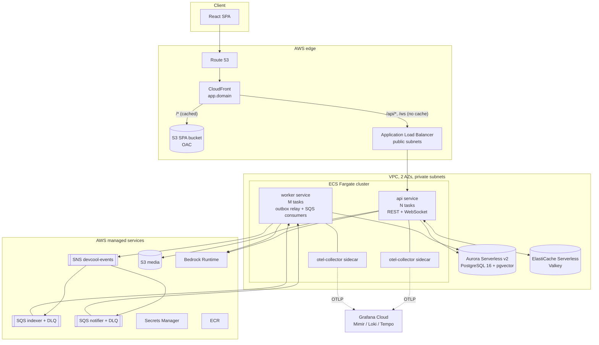
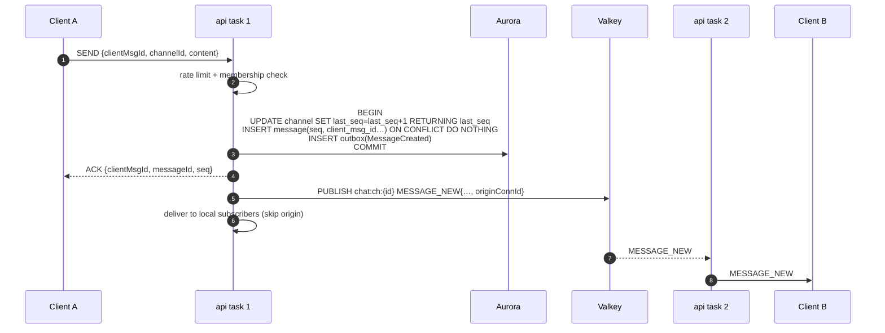
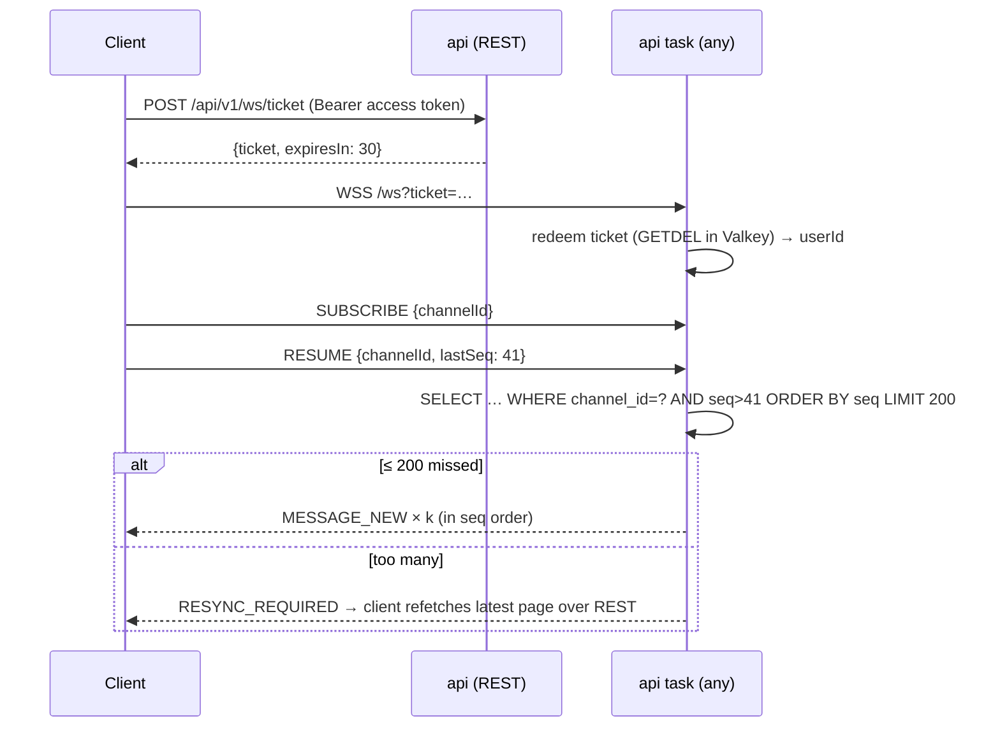
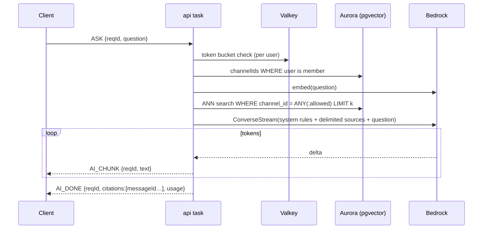
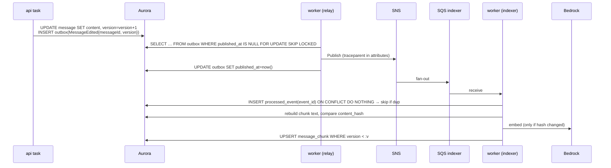

# 01 — System Architecture

The target architecture for DevCool at the end of the roadmap. It describes the containers, how requests flow through them, and the trade-offs behind the overall shape. Individual decisions each have an ADR in [`adr/`](adr/).

## 1. Starting point

| Area | Today |
|---|---|
| Backend | Spring Boot 3.5.6 / Java 21, hexagonal (ports and adapters). One deployable |
| Realtime | Raw WebSocket at `/ws`, in-memory connection registry, one JVM (see [`learning/10`](../../learning/10-realtime-architecture-design.md) §1–5) |
| Data | PostgreSQL 15 via Docker Compose. Schema from Hibernate `ddl-auto`, no Flyway migrations |
| Media | S3 upload through the API, presigned GET |
| Deploy | README describes a manual `docker push` + `aws ecs update-service`. No IaC, no deploy workflow, no load balancer |
| Frontend | None |
| Observability | None beyond default logs |

## 2. Requirements

**Functional**
- 1:1 private chat, small group chat (Lounge) and moderated group (Forum).
- Send text/markdown/image/video. Edit, delete, reply, react.
- History with infinite scroll. Unread counts. Read receipts.
- Online presence, last seen, typing indicators.
- Reconnect without losing messages.
- "Ask DevCool": question answering over past discussions the user is allowed to see, with citations.

**Non-functional**

| Property | Target | How |
|---|---|---|
| Delivery latency | p99 < 300 ms same region | Local fan-out + Redis pub/sub, no broker hop on the hot path |
| Durability | A message ACKed to the sender is never lost | Commit before ACK and before broadcast |
| Ordering | Total order **within a channel** | Per-channel `seq` (ADR-0012) |
| Duplicates | Client retries never create duplicate messages | `(sender_id, client_msg_id)` unique key |
| Availability | 99.5% monthly for the chat path | ≥2 tasks across 2 AZs, graceful drain on deploy |
| Horizontal scale | Add ECS tasks without code changes | Stateless tasks + backplane (ADR-0006) |
| Security | No cross-channel data leak, including via RAG | Membership checks in services; permission filter inside the vector query |
| Cost | Scale to near zero when idle | Aurora Serverless v2 auto-pause, ECS desired count 0, `sleep`/`hibernate` workflows |

## 3. Container view

### Container responsibilities

| Container | Responsibilities | Scales on |
|---|---|---|
| **CloudFront** | One public origin for SPA, REST and WebSocket (ADR-0011). TLS, caching for static assets, optional WAF | Managed |
| **ALB** | Routes to `api` tasks, health checks `/actuator/health/readiness`, idle timeout > heartbeat interval | Managed |
| **api** (ECS service) | REST controllers, WebSocket handler, local connection registry, Redis backplane subscriber, RAG streaming | CPU and `ws.connections.active` per task |
| **worker** (ECS service, same image, profile `worker`) | Outbox relay (`SELECT … FOR UPDATE SKIP LOCKED`) → SNS. SQS consumers: `indexer` (embeddings), `notifier` (unread/notification fan-out) | SQS `ApproximateNumberOfMessagesVisible` |
| **Aurora PostgreSQL** | Source of truth: users, channels, members, messages, outbox, `processed_event`, `message_chunk` (vectors) | ACUs (0 → N) |
| **Valkey** | Pub/sub backplane, presence keys, typing relay, WS tickets, rate-limit buckets, short-lived caches | Managed (serverless) |
| **SNS → SQS** | Durable async event fan-out to independent consumers with DLQs (ADR-0007) | Managed |
| **Bedrock** | Claude for RAG answers and summaries; Titan v2 for embeddings (ADR-0010) | Managed; our side is rate-limited |
| **OTel collector** | Batches, retries, samples and exports metrics, logs and traces (ADR-0008) | Sidecar per task |

### Hexagonal view inside `api`/`worker`

The code stays one Maven module. New capabilities follow the existing pattern (`domain/*/port/in`, `domain/*/port/out`, `application/service`, `adapters/in|out`). New outbound ports and their adapters:

| Port (domain) | Adapter (out) | Phase |
|---|---|---|
| `RealtimeBackplanePort` | `RedisBackplaneAdapter` | P4 |
| `PresencePort`, `TypingPort` | `RedisPresenceAdapter` | P4 |
| `WsTicketPort` | `RedisWsTicketAdapter` | P4 |
| `RateLimitPort` | `Bucket4jRedisAdapter` | P4/P8 |
| `OutboxPort` | `JpaOutboxAdapter` | P6 |
| `EventPublisherPort` | `SnsEventPublisherAdapter` | P6 |
| `EmbeddingPort`, `LlmStreamingPort` | `BedrockEmbeddingAdapter`, `BedrockChatAdapter` (Spring AI) | P8 |
| `ChunkStorePort` | `PgVectorChunkStoreAdapter` (JdbcTemplate) | P8 |

Inbound adapters that are not HTTP/WS (SQS listeners, the outbox relay scheduler) live under `adapters/in/messaging/` and call inbound ports, same as controllers do.

## 4. Key flows

### 4.1 Send a message (hot path)

Rules:
- Commit happens **before** the ACK and before the publish. A crash after commit but before publish loses only the push, and the client's `RESUME` recovers it (§4.2).
- A retried `SEND` with the same `clientMsgId` hits the unique key. The service returns the original `messageId/seq` and does not publish again.
- The outbox row is written in the same transaction. The async pipeline (indexing, notifications) is at-least-once even though the push is at-most-once.

### 4.2 Reconnect and resume

The client reconnects with exponential backoff plus full jitter (base 500 ms, cap 30 s), so a fleet-wide disconnect does not become a thundering herd.

### 4.3 Ask DevCool (RAG, streamed)

### 4.4 Edit → re-index (async)

### 4.5 Deploy with graceful WebSocket drain

1. ECS starts new tasks, and the ALB marks them healthy on `/actuator/health/readiness`.
2. ECS sends SIGTERM to an old task. Spring's graceful shutdown flips readiness to `REFUSING_TRAFFIC`, so the ALB stops sending new upgrades.
3. The task sends every local socket `RECONNECT {afterMs: random(0..10000)}` and closes it with code 1012 (service restart).
4. Clients reconnect to the new tasks, spread over 10 s, and `RESUME`.
5. `deregistration_delay` (30 s) and ECS `stopTimeout` (≥ 30 s) give the drain time to finish.

## 5. Design trade-offs

### 5.1 Modular monolith (api + worker from one image) vs microservices

| | Modular monolith, two services from one image (**chosen**) | Microservices (chat, presence, ai, notification) |
|---|---|---|
| Pros | One codebase, one build, one schema. Hexagonal modules keep boundaries clean. api and worker scale independently. Refactoring across modules is cheap | Independent deploy and scaling per capability. Team autonomy. Technology per service |
| Cons | One blast radius for a bad deploy of shared code. The modules share a database | Distributed transactions, service discovery, N pipelines. Much higher ops cost for a team of one |
| Interview line | "I split by **runtime profile** (latency-sensitive vs throughput work), not by noun. Microservices solve org scaling, which I don't have yet. The ports make a later extraction mechanical." | |

### 5.2 One origin (CloudFront → S3 + ALB) vs separate API domain

| | Single origin (**chosen**) | `app.x` + `api.x` |
|---|---|---|
| Pros | No CORS preflights. Refresh cookie can be `SameSite=Strict; HttpOnly; Secure`. One TLS cert. WAF in one place | Simpler CloudFront (static only). API reachable without CloudFront |
| Cons | CloudFront sits in the WebSocket path (supported, but it is one more hop). Needs a cache policy that disables caching for `/api/*` | CORS config. Cookie becomes cross-site: needs `SameSite=None` and more CSRF care |

### 5.3 Local registry + backplane vs dedicated WebSocket gateway tier

| | Each api task holds its sockets + Redis pub/sub (**chosen**, [`learning/10`](../../learning/10-realtime-architecture-design.md) option B) | Separate gateway service holds sockets, API is stateless (option H) |
|---|---|---|
| Pros | No new service. Latency: one Redis hop. Matches the existing code | API deploys don't drop sockets. Gateways scale on connections, API on CPU |
| Cons | API deploy drops sockets (mitigated by graceful drain, §4.5). Pub/sub is at-most-once | Two services, an internal protocol between them, more to operate |
| Revisit when | Deploys are frequent enough that reconnect storms show up in the metrics | |

### 5.4 Aurora Serverless v2 vs provisioned RDS PostgreSQL

| | Aurora Serverless v2 (**chosen**) | RDS PostgreSQL `db.t4g` |
|---|---|---|
| Pros | Scales to 0 ACU with auto-pause (dev). Storage auto-grows. Fast failover. pgvector supported | Cheapest steady-state price. Simple |
| Cons | Resume from pause takes seconds, so the first request after idle is slow. Price per ACU-hour is higher under constant load | Always billed. Manual storage sizing. Slower failover |

### 5.5 Other axes, briefly

| Decision | Chosen | Main alternative | Why |
|---|---|---|---|
| Realtime protocol | Raw WS + typed envelope (ADR-0005) | STOMP | Keep the existing code; STOMP's broker relay needs RabbitMQ |
| Ordering | Per-channel `seq` (ADR-0012) | Global Snowflake id | Clients need gap detection per channel, not a global order |
| Async events | Outbox → SNS → SQS (ADR-0007) | Kafka | Scale to zero, no cluster, same guarantees at this scale |
| Vector store | pgvector in the same DB (ADR-0009) | OpenSearch | Permission filter is a normal SQL join/predicate; one store to back up |
| Observability | OTel → Grafana Cloud (ADR-0008) | AWS managed (AMP/AMG/X-Ray) | Vendor-neutral instrumentation, free tier, same stack locally |

## 6. Security architecture

| Layer | Control |
|---|---|
| Edge | CloudFront TLS 1.2+, optional AWS WAF managed rules and rate rules |
| Auth | Access JWT (15 min) in memory on the client. Refresh token rotated, `HttpOnly; Secure; SameSite=Strict; Path=/api/v1/auth`. `tokenVersion` revocation |
| WebSocket | One-time ticket (30 s, single use) instead of a token in the URL. Origin allowlist (ADR-0011) |
| Authorization | Every service method that reads or writes channel data checks membership/role. Enforced by tests, not only by controllers |
| RAG | Permission filter **inside** the vector query. Retrieved text is untrusted: delimited in the prompt, never executed |
| Data | Aurora and S3 encrypted at rest (KMS). Private subnets. Security groups: ALB → api only, api/worker → DB/Valkey only |
| Secrets | Secrets Manager. Task role reads only its own secrets. No long-lived AWS keys: GitHub uses OIDC |
| Supply chain | Trivy image scan, Checkov/tflint for Terraform, Dependabot |

## 7. Scaling path beyond this roadmap

What changes at roughly 100× the load this design targets. Know these for interviews; don't build them.

| Pressure | Change |
|---|---|
| Message table too large for one Postgres | Partition `message` by `channel_id` hash or time. Then consider Cassandra/ScyllaDB/DynamoDB with `(channel_id, bucket)` partition key and `seq` clustering key |
| Every node receives every event | Already mitigated by per-channel topics. Next: sharded pub/sub (`SSUBSCRIBE`), or route by `channel_id` hash (options F/G in `learning/10`) |
| Deploys drop too many sockets | Dedicated gateway tier (option H) |
| Async volume or replay needs | Kafka/MSK with `channel_id` partition key |
| Huge channels (10k+ members) | Stop pushing presence and receipts to everyone; switch to pull-on-view. Rate-limit fan-out per channel |
| Global users | Multi-region: region-local sockets, cross-region replication of messages, a home region per channel |
