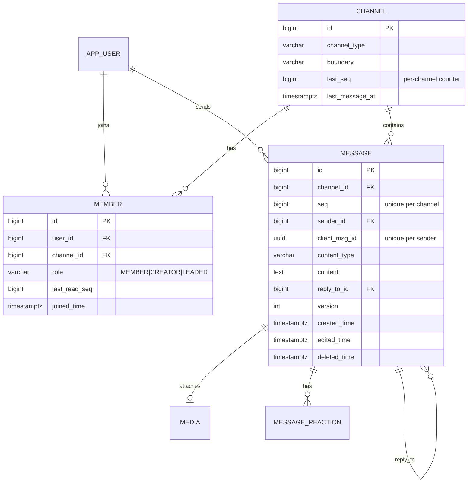
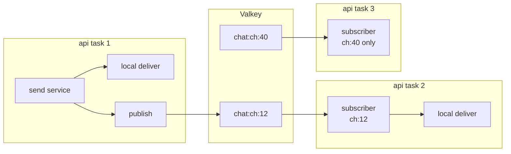
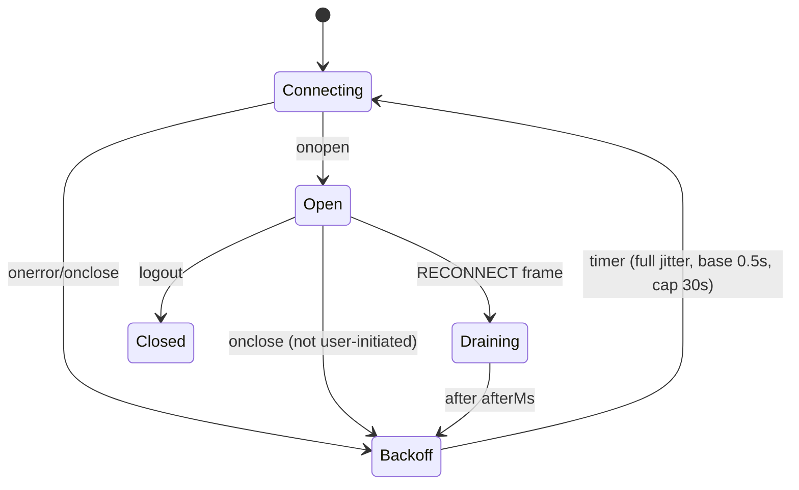

# 03 — Chat System Design (deep dive)

This is the "design Messenger" interview question, answered for DevCool, with the reasoning for each choice. It describes the target after Phases 3, 4 and 6. For the realtime option space (A–K) see [`learning/10`](../../learning/10-realtime-architecture-design.md). This doc picks from it and adds the parts that doc leaves open: ordering, delivery, presence, typing, receipts and resume.

## 1. Requirements and scale

### Functional
- Channels: 1:1 private chat, Lounge (small group, ≤ 11 people), Forum (moderated group with a leader).
- Messages: text, markdown, image, video. Edit, soft delete, reply, react.
- History: newest first, infinite scroll.
- Read state: unread count per channel, read receipts.
- Presence: online/offline, last seen. Typing indicators.
- Reliability: a client that disconnects and reconnects sees every message it missed, once, in order.

### Back-of-envelope (portfolio target, not today's load)

| Quantity | Assumption | Result |
|---|---|---|
| DAU | 10,000 | — |
| Peak concurrent sockets | 30% of DAU | **3,000** |
| Messages per user per day | 40 | 400k/day ≈ **5 msg/s avg**, ~50 msg/s peak (10×) |
| Avg recipients online per message | 4 (small groups) | ~200 pushes/s peak |
| Message size | ~300 B text + ~200 B metadata | 400k × 0.5 KB ≈ **200 MB/day**, ~75 GB/year |
| Typing events | 5× message rate, never stored | ~250 events/s peak, ephemeral |
| Presence heartbeats | 1 per socket per 25 s | 3,000 / 25 ≈ **120 writes/s** to Valkey |
| Sockets per api task | Target 5,000 (memory ~ 50–100 KB/socket incl. buffers) | 1 task enough; **2 for availability** |

Takeaways for an interview:
- Postgres handles this comfortably. The write path is ~50 inserts/s at peak.
- The first thing to break is **not** the database. It is per-process state (the registry) and the slowest client's send buffer. That's why P4 focuses on the backplane and backpressure.

## 2. Data model



Changes from today (Phase 3):

| Change | Why |
|---|---|
| `INTEGER` ids → `BIGINT` | A sequence at 2.1 billion ends the system. It's cheap to fix before there is data |
| `message.seq` + `UNIQUE (channel_id, seq)` | Ordering and gap detection per channel (ADR-0012) |
| `message.client_msg_id` + `UNIQUE (sender_id, client_msg_id)` | Idempotent send |
| `message.version` | Optimistic concurrency for edits; idempotency guard for async consumers |
| `member.last_read_seq` | O(1) unread count, receipts |
| Index `(channel_id, seq DESC)` | History pages and `RESUME` are index range scans |

## 3. Ordering: per-channel sequence

Assign `seq` inside the send transaction:

```sql
UPDATE channel SET last_seq = last_seq + 1, last_message_at = now()
 WHERE id = :channelId
RETURNING last_seq;
-- then INSERT INTO message (..., seq) VALUES (..., :lastSeq)
```

- The row lock on `channel` serializes writers **per channel**, which is exactly the order we promise. Different channels don't contend.
- A hot channel is limited to one commit at a time, roughly 1–2k msg/s on Postgres. That is far beyond a chat group's human typing rate.
- Clients detect gaps: if they hold seq 41 and receive 43, they know 42 is missing and `RESUME` from 41.

Rejected alternatives (see ADR-0012): ordering by `created_time` (clock skew between tasks, ties), a global Snowflake/ULID id (roughly time-ordered, but no gap detection), and a Redis `INCR` counter (a second system to keep consistent with the DB).

## 4. Delivery semantics

| Leg | Guarantee | Mechanism |
|---|---|---|
| Client → server | **At-least-once**, effectively-once | Client keeps unACKed sends in a pending queue and retries with the same `clientMsgId`. Server dedupes on `(sender_id, client_msg_id)` and re-ACKs with the original `messageId/seq` |
| Server → DB | Exactly once | One transaction: seq bump + insert + outbox |
| Server → other clients (push) | **At-most-once** | Redis pub/sub; a node or client can miss an event |
| Recovery | Eventually complete | `RESUME {channelId, lastSeq}` on reconnect, or on gap detection. REST `GET /channels/{id}/messages?afterSeq=` for large gaps |
| Server → async consumers | **At-least-once** | Outbox → SNS → SQS; consumers idempotent via `processed_event` + `version` |

The interview sentence: *"The push is lossy by design; the database is the source of truth and every client can prove it's up to date by comparing sequence numbers. So I don't pay for a durable broker on the hot path."*

## 5. The WebSocket protocol

Envelope (ADR-0005):

```json
{ "v": 2, "type": "SEND", "reqId": "c-17", "channelId": 12,
  "payload": { "clientMsgId": "0b9f…", "contentType": "TEXT", "content": "hi" } }
```

| Direction | Types |
|---|---|
| Client → server | `SUBSCRIBE`, `UNSUBSCRIBE`, `SEND`, `EDIT`, `DELETE`, `REACT`, `TYPING`, `READ`, `RESUME`, `PING`, `ASK`, `ASK_CANCEL` |
| Server → client | `ACK`, `NACK`, `MESSAGE_NEW`, `MESSAGE_UPDATED`, `MESSAGE_DELETED`, `REACTION`, `TYPING`, `PRESENCE`, `READ_RECEIPT`, `AI_CHUNK`, `AI_DONE`, `AI_ERROR`, `RESYNC_REQUIRED`, `RECONNECT`, `ERROR`, `PONG` |

Rules:
- Every client request carries `reqId`. The server answers each with exactly one `ACK` or `NACK` carrying that `reqId`.
- A bad frame gets `NACK`/`ERROR`. It never closes the socket (today it does).
- Every server event about a message carries `messageId`, `seq` and `createdTime`, so clients can order and dedupe.

## 6. Fan-out across nodes



- **Per-channel topics.** A task subscribes to `chat:ch:{id}` when its first local connection subscribes to that channel, and unsubscribes when its last one leaves. A task only receives events for channels it has listeners for. That's the improvement over one global topic (`learning/10` option B vs F), without a shared routing registry.
- The publishing task delivers to its own local subscribers directly and ignores its own publish on receipt (`originNodeId`). The sender's own connection is skipped by `originConnectionId`.
- **Backpressure.** Every session is wrapped in `ConcurrentWebSocketSessionDecorator(session, sendTimeLimit=5s, bufferSizeLimit=512KB, OverflowStrategy.TERMINATE)`. A slow client is disconnected (and will resume) instead of blocking everyone else.
- **Delivery threads.** Pub/sub callbacks hand off to a bounded executor (virtual threads). They never do blocking I/O on the Redis client's event loop.

## 7. Presence

**Goal:** show whether a user is online and when they were last seen, across tabs, devices and tasks.

| Piece | Design |
|---|---|
| Liveness | Key `presence:conn:{connId}` → userId, TTL 60 s. Refreshed on every client `PING` (every 25 s) |
| User online | Set `presence:user:{userId}` of live connIds. Online ⇔ set non-empty (after pruning expired conns) |
| Transitions | First connection → publish `PRESENCE{online}`. Last connection closed or expired → persist `app_user.last_seen_at`, publish `PRESENCE{offline, lastSeen}` |
| Crash safety | A task that dies doesn't run cleanup. TTL expiry covers it; a small sweeper (keyspace notifications or a periodic scan in the worker) emits the offline event |
| Audience | Presence events go to channels the user shares with others **that have ≤ 50 members** (DMs, lounges). For big forums, clients **pull** presence for visible members (`GET /presence?userIds=`) |
| Flap control | Offline is published only after a 10 s grace period, so a page refresh doesn't flash offline/online |

Push vs pull trade-off: pushing presence to every co-member costs O(members) per status change. That's fine for DMs, but it's a fan-out storm for large groups. The hybrid (push small, pull large) is the standard answer.

## 8. Typing indicators

- Never stored. Client sends `TYPING` at most once per 3 s while the user types.
- Server validates membership, then publishes to `chat:ch:{id}` as `TYPING{userId}` (the sender is skipped).
- Clients show "X is typing" and expire it after 5 s without a refresh. There is no "stopped typing" event to lose.
- Rate-limited per connection. Dropped silently under pressure, because losing one is harmless.

## 9. Read receipts and unread counts

- Client sends `READ {channelId, seq}` when the newest visible message changes. The server does `UPDATE member SET last_read_seq = GREATEST(last_read_seq, :seq)`, which is monotonic and idempotent.
- Unread count = `channel.last_seq − member.last_read_seq`, returned with the channel list. O(1), no counting query.
- Receipts are broadcast as `READ_RECEIPT{userId, seq}` to channels with ≤ 50 members, throttled to one per user per channel per 2 s. Big channels show "seen by N" on demand.
- Deleted messages still consume a seq, so unread counts include them. That is acceptable for a chat app, but be ready to say why.

## 10. Reconnect and resume

Client state machine (P5):



On `Open`:
1. Get a fresh ticket first (tickets are single-use).
2. Re-`SUBSCRIBE` every channel in view.
3. Send `RESUME {channelId, lastSeq}` for each.
4. Flush the pending-send queue (same `clientMsgId`s, so it's safe).

Server-side `RESUME` returns at most 200 messages in `seq` order. Beyond that it returns `RESYNC_REQUIRED` and the client refetches the latest page over REST and drops older cache.

Heartbeat: the client sends `PING` every 25 s and the server answers `PONG` and refreshes presence. The ALB idle timeout (default 60 s) is never reached on a live connection, and a dead one is detected within ~60 s by either side.

## 11. Deploys, failure and scaling

| Event | Behaviour |
|---|---|
| Rolling deploy | Graceful drain (see [01 §4.5](01-system-architecture.md#45-deploy-with-graceful-websocket-drain)): readiness down, `RECONNECT{afterMs: jitter}`, close 1012 |
| Task crash | Sockets drop; clients back off and resume on other tasks. Presence TTL expires in ≤ 60 s |
| Valkey unavailable | Local delivery still works for same-task users. Cross-task pushes pause; clients recover through `RESUME` on their next reconnect. Presence shows stale data. Health check stays green: Valkey is degraded, not fatal |
| Aurora paused (dev) | First request waits for resume (~15 s). Acceptable in dev only |
| Scale out | Target tracking on CPU 60% and on custom metric `ws.connections.active` (per task, target 3,000). Scale-in protection is short; drain handles moved sockets |

## 12. Security specifics

- **Authenticated is not authorized.** Every channel read/write path checks membership in the service (lesson from `docs/improvements/lessons.md`). The WebSocket `SUBSCRIBE` and `RESUME` handlers check it too.
- Roles: channel management follows the role table in `ChannelPermissionPolicy` (P1-T06). Any member can leave.
  - Forum: only `CREATOR`/`LEADER` can update the channel or add members.
  - Lounge: any member can update the channel or add members, up to 11 people.
  - Private chat: either participant can update the channel; nobody can add members.
  - Removing members is defined in P3-T11.
- Per-user rate limits: `SEND` 10/s burst 20, `TYPING` 1/2 s, `ASK` 20/hour.
- Message content is length-limited (4 KB text) and rendered as sanitized markdown on the client, with no raw HTML.

## 13. Interview checklist

You should be able to explain each of these in two sentences, using this system:

- [ ] Why commit before ACK, and before broadcast
- [ ] How a duplicate send is detected, and what the second ACK contains
- [ ] Why per-channel seq and not timestamps or a global id
- [ ] Why the push can be at-most-once and the system still loses nothing
- [ ] How two users on different ECS tasks talk to each other
- [ ] What happens to sockets during a deploy
- [ ] How presence survives a crashed task
- [ ] Why typing is never persisted, and why there's no "stopped typing" event
- [ ] How unread count is O(1)
- [ ] The first three things you'd change at 100× (see [01 §7](01-system-architecture.md#7-scaling-path-beyond-this-roadmap))
