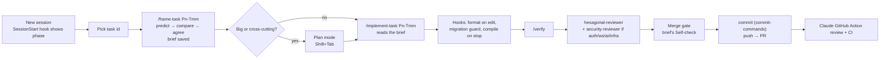

# Claude Code in DevCool: concepts, setup and interview notes

This page explains **what** each Claude Code mechanism is, **when** to use it, and **how this repo uses it**. Everything was checked against the official docs at https://code.claude.com/docs (Sept 2026). When something here disagrees with the docs, the docs win. Update this page.

## 1. The mental model

Claude Code is an **agentic loop**:
1. Read the context (instructions + conversation + tool results).
2. Decide on an action (read a file, run a command, edit).
3. Observe the result.
4. Repeat until done.

Two consequences drive every configuration choice:

1. **The context window is the scarce resource.**
   - Everything loaded costs tokens *every turn*: CLAUDE.md, rules, skill text, file reads, tool output.
   - Irrelevant context also dilutes attention and reduces how well instructions are followed.
   - Good setup means loading the *right* instructions at the *right* time.
2. **The model is probabilistic; some things must not be.**
   - "Please always format" is a request.
   - A hook that runs the formatter is a guarantee.
   - Use instructions for judgement and deterministic mechanisms for invariants.

Useful commands:
- `/context` shows what fills the window right now.
- `/compact` summarizes the conversation to free space. The root CLAUDE.md and the plan file are re-injected after compaction.
- `/clear` starts fresh.
- `/rewind` (or Esc Esc) restores code and conversation to a checkpoint.

## 2. Which mechanism for which need

| Need | Mechanism | Loaded when | Deterministic? | In this repo |
|---|---|---|---|---|
| Facts true for every task (commands, layout, workflow) | `CLAUDE.md` (root) | Every session, always | No | `CLAUDE.md` (kept < 200 lines) |
| Conventions for one directory | Nested `CLAUDE.md` | When Claude reads files there | No | `frontend/CLAUDE.md`, `infra/CLAUDE.md` |
| Conventions for a file pattern anywhere | `.claude/rules/*.md` with `paths:` | When Claude reads a matching file | No | `hexagonal`, `testing`, `flyway`, `websocket-protocol`, `genai-safety` |
| A repeatable procedure or reference | **Skill** (`.claude/skills/<name>/SKILL.md`) | When invoked (`/name`) or when Claude judges it relevant from its description | No, but it can run shell commands for live context | `frame-task`, `implement-task`, `new-use-case`, `flyway-migration`, `verify`, `write-adr`, `interview-prep`, `ws-protocol` |
| Isolated work whose details shouldn't pollute the main context | **Subagent** (`.claude/agents/<name>.md`) | When delegated; runs in its own context and returns a summary | No | `hexagonal-reviewer`, `security-reviewer`, `test-writer`, `aws-architect` |
| Something that must *always* or *never* happen | **Hook** (`settings.json` → `hooks`) | On lifecycle events | **Yes** | format on edit, block merged-migration edits, block destructive commands, session context, compile on stop |
| What Claude may do without asking | **Permissions** (`allow` / `ask` / `deny`) | Every tool call | **Yes** | `.claude/settings.json` |
| External tools and data | **MCP servers** | Tools deferred until searched/used | Tools themselves are | `.mcp.json` (AWS Knowledge); plugins for Terraform, Grafana, Playwright later |
| A bundle of the above, versioned and shareable | **Plugin** | Per enabled plugin | Depends | `jdtls-lsp`, `typescript-lsp`, `commit-commands`, `pr-review-toolkit` |
| Code navigation without reading whole files | **LSP (code-intelligence plugin)** | On demand | Yes | `jdtls-lsp` (Java), `typescript-lsp` |
| CI automation | GitHub Action / headless `claude -p` | On events | — | `.github/workflows/claude.yml` |

Rules of thumb:
- If you've written "always" or "never" in CLAUDE.md and it matters, make it a **hook** or a **permission**.
- If an instruction only matters for some files, make it a **rule with `paths:`**.
- If it's a multi-step procedure, make it a **skill**.
- If the work involves reading lots of files but you only need the conclusion, use a **subagent**.

## 3. Memory: CLAUDE.md, rules and imports

- **Load order.**
  - At launch: every `CLAUDE.md` from the working directory up to the root, plus `~/.claude/CLAUDE.md`.
  - On demand: nested `CLAUDE.md` files load when Claude reads files in their directory.
- **Size.** Target under 200 lines per file. Longer files lower adherence and cost context on every turn.
- **`@path` imports** expand at launch, so they help organization but **don't** save context. That's why the long request-flow example moved to `docs/architecture-request-flow.md` and is *linked*, not imported.
- **`.claude/rules/*.md`**:
  - Without `paths:` → loaded at launch, like CLAUDE.md.
  - With `paths:` → loaded when Claude reads a matching file.

  ```markdown
  ---
  paths:
    - "src/main/resources/db/migration/**"
  ---
  ```
- **Auto memory** (`~/.claude/projects/<project>/memory/`) holds notes Claude writes itself (preferences, project facts). It complements CLAUDE.md; it doesn't replace it.
- **Personal overrides:** `CLAUDE.local.md` and `.claude/settings.local.json` (both gitignored here).

## 4. Settings and permissions

Settings precedence, highest first:
1. Managed (organization)
2. CLI flags
3. `.claude/settings.local.json`
4. `.claude/settings.json` (committed)
5. `~/.claude/settings.json`

Arrays like permission rules merge across scopes.

Permission rules use `Tool(specifier)`:
- `Bash(./mvnw *)`: prefix/wildcard match on the command. Compound commands (`a && b`) are checked per subcommand.
- `Read(./local.env)`, `Read(./**/*.tfstate)`: gitignore-style paths relative to the settings file's project. `//abs/path` for absolute paths.
- Order of evaluation: **deny** beats **ask** beats **allow**.

This repo:
- **allow:** safe, frequent commands (`./mvnw`, `npm run`, `terraform plan`, read-only `git`/`gh`).
- **ask:** outward-facing or state-changing ones (`git push`, `gh pr create`, `terraform apply`, any `aws`).
- **deny:** secrets and state files (`local.env`, `.env`, `*.tfstate`) and `terraform destroy` / force pushes.

**Permission modes** (Shift+Tab to cycle):
- `default`: ask per the rules.
- `acceptEdits`: auto-accept file edits.
- `plan`: read-only; Claude proposes a plan file.
- `auto`: a classifier approves safe actions.
- `bypassPermissions`: only in sandboxes/containers.

Plan mode is the right start for anything spanning packages. Claude writes a plan file that survives compaction.

**Sandboxing:** the sandboxed Bash tool restricts filesystem and network access at the OS level, which is defence in depth beyond permission rules. Consider it when running in `auto` mode for long tasks.

## 5. Hooks

Hooks are commands (or HTTP calls, prompts, agents) that run on lifecycle events. The main events:
- `SessionStart`, `UserPromptSubmit`
- `PreToolUse`, `PostToolUse`
- `Stop`, `SubagentStop`
- `PreCompact`, `Notification`

Mechanics:
- The hook receives JSON on stdin: `tool_name`, `tool_input.file_path`, `tool_input.command`, `session_id`, `prompt_id`, and so on.
- **Exit 0** = OK. For `SessionStart`/`UserPromptSubmit`, stdout is added to Claude's context.
- **Exit 2** = block. stderr is shown to Claude, so it can react. For `PreToolUse` that means the tool call doesn't run; for `Stop`, Claude keeps working.
- Other exit codes = a non-blocking error.
- Richer control: JSON on stdout (`hookSpecificOutput.permissionDecision: "deny"`, `additionalContext`, `updatedInput`).
- `matcher` filters by tool name (`Edit|Write`) or source (`startup|resume|compact`). An `if` field narrows tool events with permission-rule syntax (`Bash(git *)`).
- `$CLAUDE_PROJECT_DIR` points at the repo root.

This repo's hooks (`.claude/hooks/`):

| Hook | Event | Why it's a hook, not an instruction |
|---|---|---|
| `session-context.sh` | `SessionStart` (startup/resume/compact) | Parses the roadmap status so every session, including after compaction, knows the current phase and next tasks |
| `protect-migrations.sh` | `PreToolUse` Edit/Write | Editing a migration that already ran breaks Flyway checksums in real environments. This must *never* happen, so it's enforced (exit 2) |
| `guard-bash.sh` | `PreToolUse` Bash | Catches `terraform destroy`, `apply -auto-approve`, force pushes, destructive `aws` calls and `cat local.env`, even inside compound commands |
| `format-java.sh` | `PostToolUse` Edit/Write | Spotless on the one edited file. Keeps diffs clean without Claude spending turns on formatting |
| `format-other.sh` | `PostToolUse` Edit/Write | Prettier for `frontend/`, `terraform fmt` for `.tf`, when the tools are installed |
| `compile-on-stop.sh` | `Stop` | Claude can't end a turn with Java that doesn't compile. It only runs when Java changed, and a per-prompt loop guard (max 2 blocks) prevents infinite loops |

Test a hook without Claude:
```bash
echo '{"tool_input":{"file_path":"'$PWD'/src/main/resources/db/migration/V1__baseline.sql"}}' \
  | CLAUDE_PROJECT_DIR=$PWD .claude/hooks/protect-migrations.sh; echo "exit=$?"
echo '{"tool_input":{"command":"git push --force origin feat/x"}}' | .claude/hooks/guard-bash.sh; echo "exit=$?"
```
`/hooks` lists the active hooks; `claude --debug` shows hook execution.

## 6. Skills

A skill is a directory with `SKILL.md` (YAML frontmatter + instructions) plus optional supporting files. It replaces the legacy `.claude/commands/*.md`; both create `/name`.

Frontmatter used here:

| Field | Effect | Example here |
|---|---|---|
| `description` | Claude reads every skill's description to decide when to auto-invoke. Lead with trigger words | all |
| `disable-model-invocation: true` | Only the user can run it (side effects, or expensive) | `frame-task`, `implement-task`, `verify`, `write-adr`, `interview-prep` |
| `user-invocable: false` | Only Claude loads it (background reference) | `ws-protocol` |
| `arguments: [a, b]` | Named args `$a`, `$b`; `$ARGUMENTS` for the whole string | `frame-task` / `implement-task` (`$task`), `new-use-case` (`$area`, `$name`) |
| `paths:` | Auto-activate for matching files | `flyway-migration`, `ws-protocol` |
| `context: fork` + `agent:` | Run in an isolated subagent; only the result comes back | `interview-prep` |
| `` !`cmd` `` | Runs before Claude sees the skill; its output is inlined. A non-zero exit aborts the skill | `verify` (changed files), `flyway-migration` (existing versions) |

**Supporting files.** A skill directory can hold more than `SKILL.md`: templates, examples, scripts. Link them from `SKILL.md` and Claude reads them only when the step needs them, so the skill itself stays short. `frame-task/brief-template.md` is the example here.

Skill content stays in context after invocation, and is re-attached after compaction within a token budget. Keep skills focused.

## 7. Subagents

A subagent is a separate Claude instance with its own context window, system prompt (the agent file's body), tool allowlist and optional model. It receives the task message, CLAUDE.md and git status, but **not** your conversation. It returns a final report.

Use them for:
- **Exploration:** "find everything that touches X". The main context gets the conclusion, not 40 file reads.
- **Independent review:** a reviewer who didn't write the code isn't anchored on it.
- **Parallel work:** optionally in **worktree isolation** (`isolation: worktree`), so parallel agents don't edit the same checkout.

Frontmatter used here:
- `tools` / `disallowedTools`: reviewers can't edit.
- `model`: `sonnet` for pattern-checking, `inherit` for deep work.
- `memory: project`: `hexagonal-reviewer` keeps recurring findings in `.claude/agent-memory/hexagonal-reviewer/`, so it gets better at this repo over time.
- `color`.

Invoke a subagent by naming it ("ask the hexagonal-reviewer to review this branch"), with `@agent-hexagonal-reviewer`, or let Claude delegate proactively (descriptions that say "use proactively" encourage this).

Built-in agents worth knowing:
- `Explore`: read-only search.
- `Plan`: design in plan mode.
- `general-purpose`.

## 8. MCP and plugins

- **MCP** (Model Context Protocol) connects Claude to external tools over stdio or HTTP.
  - Project servers live in `.mcp.json`, and each user approves them once.
  - Tool definitions are deferred and found through tool search, so many servers don't bloat context. Still: only add servers you use.
  - `/mcp` shows status and handles authentication.
- **This repo:**
  - `aws-knowledge` (AWS documentation, HTTP, no credentials).
  - Later phases enable the `terraform` (HashiCorp MCP) plugin in P2, `playwright` and `frontend-design` in P5, and `grafana-cloud-mcp` in P7.
  - context7 is already configured at user level for library docs.
- **Plugins** bundle skills, agents, hooks, MCP servers and LSP servers, installed from marketplaces (`/plugin`).
  - Enabling them in the project's `enabledPlugins` makes every contributor get them.
  - **Code-intelligence plugins** (`jdtls-lsp`, `typescript-lsp`) let Claude jump to definitions and find references via a language server instead of grepping. They need the server binaries installed locally (P0-T10).

## 9. Daily workflow on DevCool



### Frame before you build: `/frame-task`

A roadmap task is one line, like `P3-T03 MessageService.save: seq assignment + idempotent send`. That line says *what* to build. It doesn't say why, what "done" means, or which ideas you need to understand to judge Claude's code. A good engineer answers those questions before writing code. `/frame-task` makes that step routine, and the result is concrete enough for `/implement-task` to build against.

**Use it**
- `/frame-task P3-T03` frames that task. `/frame-task` with no id picks the next unticked task in the in-progress phase.
- Claude restates the task in plain words and asks for your **prediction**: why it's needed, what must be true when done, which tests prove it, and an estimate. Answer in a few bullets, or type `skip`.
- Read the brief, answer the (at most 4) open decisions, and you're done. It takes about 15 minutes.

**What you get** (saved to `docs/journal/briefs/<id>.md`, template in `.claude/skills/frame-task/brief-template.md`)

| Section | Answers |
|---|---|
| Why | What's wrong or missing today (with `path:line`), and what fails without this task |
| Value to the goal | Task → phase goal → milestone (M1–M5) → roadmap target, plus the tasks it unblocks and the interview story it builds |
| Core concepts | 2–5 ideas, each with a **Without** example (a DevCool scenario that fails) and a **With** example (the same scenario, fixed) |
| Requirements | Scope in/out, Given/When/Then acceptance criteria, invariants, authz, test list, likely files, dependencies |
| Decisions | Open questions and your answers, or the ADR/doc that settled them |
| Prediction vs brief | Where your prediction differed, tagged *knowledge gap* (with what to read), *plan issue* (you were right; the brief changed) or *open* |
| Self-check | The three merge-gate questions ([playbook §3](../delivery-playbook.md#3-the-task-loop)) for this task |

**Why predict first?** Writing your own answer before you see Claude's turns the brief from something you read into something you check. Every *knowledge gap* is a topic to study; every *plan issue* is a bug caught before any code exists. Both go into the journal as evidence.

**How it connects:**
- `/implement-task` reads the brief when it exists and treats its requirements and decisions as agreed. If the implementation departs from the brief, it records why in the brief's Decisions table.
- If framing finds a conflict with an ADR, the skill stops and suggests `/write-adr` instead of choosing a side.
- It doesn't write code, create branches or tick the task.

Habits that pay off:
- **Explore → plan → code → verify.** Don't let Claude code before it has read the relevant code and ADR.
- **Give Claude a way to check its work:** tests, `/verify`, a running app. It's the single biggest quality lever.
- **Keep the context clean:**
  - Delegate broad searches to subagents.
  - `/clear` between unrelated tasks.
  - `/compact <focus>` when a long task is getting heavy.
- **Parallel work:** `claude --worktree` (or `isolation: worktree` agents) for a frontend task running alongside a backend task.
- **Checkpoints:** every edit is checkpointed. `/rewind` undoes a wrong turn faster than arguing with it (bash side effects like DB changes are *not* rewound).
- **Headless:** `claude -p "…" --output-format json` in scripts and CI. The GitHub Action (`.github/workflows/claude.yml`) runs Claude Code on PRs and `@claude` mentions.

## 10. Verifying this setup

```bash
jq . .claude/settings.json >/dev/null && echo "settings OK"
bash -n .claude/hooks/*.sh && echo "hook syntax OK"
```
Inside `claude`:
- `/hooks` lists 6 hook entries.
- `/agents` shows 4 project agents.
- Typing `/` lists the user-invocable skills, including `frame-task`.
- `/mcp` shows `aws-knowledge`.
- `/doctor` reports no config errors.
- Open a migration file, then `/context`: the `flyway` rule appears under memory files.

## 11. Interview Q&A

**Q1. How do you use AI coding tools without lowering code quality?**
I make verification cheap and automatic:
- Tests and a `/verify` skill the agent runs itself.
- Hooks that format and compile.
- An independent reviewer agent that checks architecture rules.

The agent does the work; deterministic checks and a second reviewer decide if it's acceptable, and I review the diff and design decisions.

**Q2. CLAUDE.md vs hooks: when do you need which?**
CLAUDE.md is guidance the model weighs; hooks are code that always runs. Anything whose violation is costly or irreversible, like editing a merged migration or running `terraform destroy`, must be a hook or a deny rule. Style preferences and architecture explanations belong in instructions.

**Q3. Why not put every convention in CLAUDE.md?**
It loads on every turn, in every session. A long file costs tokens and reduces adherence. Path-scoped rules load Flyway rules only when Claude opens a migration and WS protocol rules only when it touches socket code.

**Q4. Skill vs subagent?**
A skill injects instructions into the *current* context. It's good for procedures where you want to watch and steer. A subagent runs in a *separate* context and returns only its conclusion. It's good for research or review that would otherwise fill the main context with file reads. A skill can also fork into a subagent (`context: fork`) for the best of both.

**Q5. How do you stop an agent from leaking secrets?**
In layers:
1. `deny` rules on reading `local.env`, `.env` and `*.tfstate`.
2. A PreToolUse hook that blocks `cat .env` variants in Bash.
3. Secrets never in the repo (Secrets Manager, OIDC instead of AWS keys).
4. Sandboxing for autonomous runs.

No single layer is trusted alone.

**Q6. What's the risk of letting an agent run infrastructure commands?**
Irreversible, costly actions. Here `plan` is allowed, `apply` always asks, and `destroy` and `-auto-approve` are blocked by both a deny rule and a hook. The `aws-architect` subagent reviews plans read-only, and production applies go through a GitHub environment with required reviewers.

**Q7. How do you keep the agent aligned with architectural decisions over a 3-month project?**
The decisions are written as ADRs, and the `implement-task` skill reads the linked ADRs before coding and must stop on conflicts. ArchUnit tests enforce the hexagonal rules mechanically, and the reviewer agent carries project memory of recurring violations.

**Q8. How does context survive long sessions?**
Compaction summarizes the conversation. The root CLAUDE.md and the plan file are re-injected, path-scoped rules reload when files are read again, and a SessionStart hook with the `compact` matcher re-injects the roadmap status.

**Q9. What is MCP and why does it matter?**
An open protocol for connecting models to tools and data. It decouples the agent from integrations: the same AWS docs or Grafana server works across clients. Tool search defers the definitions, so adding servers doesn't flood context, but each server is still an attack surface. Approve deliberately.

**Q10. What's a good first automation for a team adopting Claude Code?**
A committed `.claude/settings.json` with sensible permissions and a format-on-edit hook, a short CLAUDE.md with build/test commands, and a `/verify` skill. Then add review agents once people trust the loop.

**Q11. How would you measure whether the setup helps?**
- Lead time per task and CI failure rate on agent-authored PRs.
- Review comments per PR.
- Tokens and cost per task (OpenTelemetry export from Claude Code).
- Which skills are actually invoked (the `skill_activated` telemetry events).

Retire unused rules and skills.

**Q12. Worktrees: why?**
Parallel agents in one checkout overwrite each other and fight over the build directory. A worktree gives each agent its own checkout on its own branch. `symlinkDirectories` shares heavy directories like `node_modules`.

**Q13. Exit code 2 vs JSON output in hooks?**
Exit 2 is the simple block, with stderr shown to Claude. JSON gives finer control: `permissionDecision` allow/deny/ask with a reason, `updatedInput` to rewrite a command, or `additionalContext` to inform without blocking.

**Q14. How do you avoid a Stop hook trapping Claude in a loop?**
Only act when something relevant changed (a fingerprint of the Java diff), and cap the blocks per prompt, then let the stop through with a report. `compile-on-stop.sh` does both.

**Q15. Plan mode — when?**
When a change spans several packages, touches a schema/API/protocol, or you're not sure of the approach. Claude explores read-only and writes a plan you approve. That's cheaper than reverting a wrong implementation.

**Q16. What would you never let an agent do unattended?**
- Merge to the main branch.
- Apply infrastructure.
- Rotate or read secrets.
- Run data migrations against shared databases.
- Send anything to external parties.

These stay behind `ask`, deny rules, or a human in CI.

**Q17. How do code-intelligence plugins help?**
They provide go-to-definition, find-references and diagnostics from a real language server. Claude reads the three relevant files instead of grepping and reading twenty, which is faster and cheaper, with fewer wrong guesses in large codebases.

**Q18. How does the GitHub Action fit?**
It runs Claude Code headless on PR events: an automatic review against CLAUDE.md's review guidelines, plus `@claude` on-demand fixes. It complements CI; it doesn't replace tests.

**Q19. Biggest failure modes you've seen with coding agents?**
- Confidently editing without reading the code.
- Weakening tests to pass.
- Silently diverging from agreed design.
- Context bloat in long sessions.

The mitigations here: "explore first" in skills, a "never weaken tests" rule, ADR checks, subagents, and `/clear`.

**Q20. Where's the line between the agent's work and yours?**
I own the problem framing, the architecture decisions (ADRs), the review of the diff and the risky operations. The agent owns the mechanical translation of a clear task into code and tests, and first-pass reviews. The setup is designed so that line is enforced, not just intended.

**Q21. How do you stop an agent from building the wrong thing well?**
Agents are good at turning a clear spec into code and bad at noticing that the spec is vague. So a framing step comes before any code:
1. `/frame-task` has me predict the why, the acceptance criteria and the tests.
2. The agent then compares my prediction with the plan, the ADRs and the current code.
3. Every open decision gets settled and written into a brief.

`/implement-task` builds against that brief, and the brief's self-check questions become the merge gate. Mistakes in the plan surface in a 15-minute conversation instead of in a PR review.
