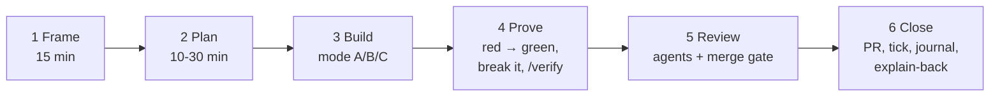

# DevCool — Delivery playbook

How to run the 12-week roadmap as a solo, full-time developer. The goals: ship fast with Claude Code, and come out knowing what you built, with production-like experience and answers you can give in an interview.

The other docs answer different questions. This one doesn't repeat them:

| Question | Where |
|---|---|
| What to build, in what order | [Roadmap](README.md), [phases](phases/) |
| Why this design | [Architecture](architecture/), [ADRs](architecture/adr/) |
| Where to learn each topic | [Reference library](../references/README.md) |
| How the Claude Code mechanisms work | [Claude Code guide](claude-code/claude-code-guide.md) |
| **How to run each day, week and task so that speed, learning, experience and interview readiness all happen** | **This playbook** |

---

## 0. Profile and goals

| Input | Value | What it changes here |
|---|---|---|
| Time | Full-time, ~35–40 h/week, 12 weeks from 2026-09-29 | Daily rhythm in §4; the roadmap schedule holds |
| Experience | 1–3 years backend | Spring and SQL basics assumed; the depth goes into distributed systems, operations and production habits |
| Target roles | Backend-heavy, with cloud and AI skills | Backend interview track first (week 6), AI track second (week 11), see §8 |
| Learn by hand | Backend core > GenAI/RAG > realtime + distributed | Ownership modes in §2 |
| Delegate | AWS/Terraform/CI, observability wiring, the React frontend | Mode C in §2 |
| Main risks | Going too slow / scope creep; no production experience | §4 (pace and cuts), §5 (simulated production) |
| Real users | None; simulated only | Game days, blind drills, synthetic traffic |
| AWS budget | **< $20/month** | Hibernated by default, awake windows, a budget ADR (§6) |
| Journal | Committed in [`docs/journal/`](../journal/README.md) | Templates in §9 |

**The four goals, and how you'll know you hit them**

| Goal | Evidence at the end |
|---|---|
| Real knowledge of what you built | You can whiteboard every flow in [01 §4](architecture/01-system-architecture.md#4-key-flows) from memory and answer every "Self-check" in the reference files for your mode A/B areas |
| Real experience | 10+ game-day incident reports with time-to-detect and time-to-recover, a load-test report, deploys and rollbacks you ran, and a monthly AWS bill you kept under $20 |
| Faster delivery with AI, without lower quality | Your journal metrics: tasks per week, estimate vs actual, CI failures, reviewer findings, and a log of what Claude got wrong and how you caught it |
| Interview answers | A backend kit by week 6 and an AI kit by week 11 (§8), rehearsed out loud |

**Inputs still open.** Fill these in as you learn them; the playbook refers to them.

- [ ] Target companies and roles, with the dates of the first interviews.
- [ ] Measured awake cost per hour after the first AWS window (compare with the §6 estimate).
- [ ] Your three weakest topics after the week-4 interview drill.
- [ ] The game-day scenario you're most nervous about (schedule it early, not late).
- [ ] Daily hours that actually work for deep focus (adjust §4).

---

## 1. Operating rules

1. **One hands-on task, at most one delegated task.** You work on one mode A/B task. At most one mode C task runs in a Claude worktree at the same time. Nothing else is "in progress".
2. **Every task ends with evidence.** A test that failed before and passes now, a number (latency, count, cost), or a journal note. No evidence, not done.
3. **Never merge what you can't explain.** The merge gate in §3 applies to Claude's code and to yours.
4. **Timebox and cut; don't stretch.** Estimates are commitments to decide, not to finish. Past 1.5× you split the task; past 2× you cut it (§4).
5. **Local-first; AWS in windows.** Everything is developed and drilled locally. AWS is woken for planned windows only, then hibernated (§6).
6. **Stories are captured the day they happen.** A bug, a surprise or a trade-off goes into the journal that evening, with numbers. You'll never remember them in week 12.

---

## 2. Ownership: who writes what

Three modes:

| Mode | You | Claude | Claude output style |
|---|---|---|---|
| **A. Drive** | Write the core logic, SQL and first test for each behaviour yourself | Explores, scaffolds the boring parts, reviews, extends tests | **Learning**: Claude leaves design decisions to you as `TODO(human)` |
| **B. Pair** | Design first: invariants, sequence diagram, test list. Write the hard core | Writes the rest from your design; reviews your core | **Explanatory**: `Insight` blocks explain its choices |
| **C. Delegate + operate** | Frame the task, review the plan or diff, run the operations yourself (apply, deploy, sleep/wake, drills) | Writes it, usually in a separate worktree | Default or Concise |

Switch styles with `/output-style` ([docs](https://code.claude.com/docs/en/output-styles)).

| Area | Phases | Mode | What "you write" means here |
|---|---|---|---|
| Backend core | P1, P3 | **A** | Authorization checks, DTO boundaries, Flyway baseline, seq assignment and idempotent send (P3-T03), edit/delete rules, history queries, read state |
| GenAI core | P8a–d | **A** | `ChunkBuilder` (P8-T02), the retrieval SQL and permission filter (P8-T09), the leak test (P8-T10), the prompt and citation validation (P8-T13), the eval harness and metrics (P8-T19) |
| GenAI wiring | P8 | C | Spring AI adapters (P8-T03, T12), Terraform (P8-T07), the frontend panel (P8-T15) |
| Realtime | P4 | **B** | Ref-counted subscribe/unsubscribe (P4-T08), `RESUME` (P4-T09), presence transitions (P4-T10), drain (P4-T14). Claude writes the envelope DTOs, dispatcher, typing, metrics |
| Async events | P6 | **B** | The relay loop with `SKIP LOCKED` (P6-T05) and the idempotent/order-tolerant consumer base (P6-T07). Claude writes Terraform, LocalStack wiring, housekeeping |
| Infra, CI/CD, observability | P2, P7 | C | Nothing by hand, but you read every `terraform plan`, run every apply and every power change, and write the runbooks' "why" |
| Frontend | P5 | C | Nothing by hand. You review behaviour and the WS client state machine (P5-T06) |

**Tests.** In modes A and B you write the first failing test for each behaviour, because choosing the assertion *is* understanding the behaviour. Claude then adds edge cases, and you check that each new test can actually fail.

---

## 3. The task loop

One task = one PR. Each step has a timebox.



1. **Frame (15 min).** Run `/frame-task Pn-Tmm`: it asks for your prediction, then compares, explains the concepts with with/without examples, asks the open decisions and saves the brief in [`docs/journal/briefs/`](../journal/README.md). The skill reads the sources for you; the prediction is still yours:
   - Read the task line, its phase's Design notes and Test plan, and the linked ADR.
   - The first time you meet a topic, also read the "Read first" of its [reference file](../references/README.md) (cap: 60 min).
   - Give your **prediction** when the skill asks: the invariants, a design sketch and the test list. For mode C, the acceptance criteria are enough.
2. **Plan (10–30 min).**
   - Use plan mode when the task touches more than 5 files, a migration, the protocol or infra.
   - Compare Claude's plan with your prediction. Every difference is either a gap in your knowledge or a mistake in Claude's plan. Write down which one it was.
3. **Build.**
   - Run `/implement-task Pn-Tmm` in the task's mode.
   - In mode A, answer Claude's `TODO(human)` requests yourself. Ask it questions; don't ask it to "just do it".
4. **Prove.**
   - Red before green: the new test must fail on the old code. If you can't make it fail, it doesn't test anything.
   - **Break it on purpose** (A/B): remove the row lock, drop the `ON CONFLICT`, skip the membership check. Watch the right test fail, then restore.
   - Run `/verify`.
5. **Review.**
   - Run the `hexagonal-reviewer` agent. For auth, WebSocket, AI or infra changes, run the `security-reviewer` agent as well.
   - Then the **merge gate**: answer these three questions out loud, or in the journal.
     1. **What does it do?** In two sentences, without reading the code.
     2. **Why this way?** Which ADR or trade-off, and the option you didn't take.
     3. **How does it fail, and how would I know?** The test that covers it, the metric or log that would show it.

     If you can't answer one of them, you don't merge. Go back and read, or ask Claude to explain that part, and try again.
6. **Close.**
   - Tick the task, open the PR, get CI green.
   - Write a 10-minute journal entry (§9).
   - **Explain-back:** answer the reference file's Self-check questions for this topic without notes. Every one you miss goes on your question list for Friday.

### Prompt library

Copy these and adapt the task id.

| When | Prompt |
|---|---|
| Frame | `/frame-task P3-T03` covers this. For a free-form variant: `Read P3-T03 in the phase file and ADR-0012. Don't write code. List the invariants this task must hold, how each could be violated under concurrency or retries, and the test that proves each. Then compare with my notes: <paste>` |
| Mode A start | `/output-style` → Learning, then: `Implement P3-T03, but leave the seq assignment and the retry path to me as TODO(human). Build everything around them.` |
| Review, not rewrite | `Review my changes in <files> for race conditions, missing authorization and missing tests. Point at lines and explain the failure. Don't rewrite the code.` |
| Break it | `Suggest three one-line changes that would break the invariant in <class>, and for each, the test that should catch it. Don't apply them.` |
| Mode C kick-off | `claude --worktree p5-t04`, then: `Implement P5-T04 per the phase file and frontend/CLAUDE.md. Run the frontend checks from /verify. Summarize what you did and anything you guessed. Don't push.` |
| Terraform review | `Explain this terraform plan resource by resource: why it exists, whether it bills hourly in ap-southeast-1, and what breaks without it.` |
| Grill me | `Act as a senior backend interviewer. Ask me one question at a time about <topic> in DevCool, broad first, then follow-ups on my answers. Don't give answers until I've tried. After 8 questions, score me and list the gaps with the files I should read.` |
| Incident report | `Here is my game-day log: <paste>. Fill the incident template from docs/plans/delivery-playbook.md §9. Ask me for anything missing; don't invent timings or numbers.` |
| Story | `Turn these journal entries <paths> into a STAR story under 250 words, using only numbers that appear in them. Mark anything you'd need me to confirm.` |

---

## 4. Pace and scope control

### Daily rhythm (full-time)

| Time | What |
|---|---|
| 08:30–08:50 | Start: the SessionStart hook shows the phase. Pick today's A/B task and the C task. Write the Frame for the A/B task |
| 08:50–09:00 | Kick off the C task in a worktree (`claude --worktree <name>`) so it runs while you focus |
| 09:00–12:00 | **Deep block**, mode A/B. Notifications off |
| 13:00–13:45 | Review the C task's diff (Explanatory style), give feedback, queue its next step |
| 13:45–16:00 | Finish the A/B task: prove, verify, review, PR |
| 16:00–17:00 | Read: the deep-dive part of tomorrow's reference file |
| 17:00–17:15 | Journal: task entry, reflection prompts, cut-list update |

**Fridays:** 09:00–11:00 game day (§5), 11:00–12:00 incident report, 13:00–14:00 weekly review (§9), 14:00–15:00 interview drill (§8), 15:00–17:00 buffer for whatever slipped.

### Sizing and stop rules

- Estimate every task in hours in the Frame step. Most roadmap tasks are 2–6 hours; none should be more than a day.
- At **1.5×** the estimate: stop and split. What's the smallest mergeable part?
- At **2×**: cut the rest to the Could list, or park it, and write down why. Unfinished-but-merged beats finished-never.
- **Parking lot.** Refactors, "nice to haves" and ideas outside the task go into the week file's parking lot, not into the PR.
- A task blocked for more than an hour: ask Claude to explore the blocker in a subagent, switch to the next task, and come back after lunch.

### Must / Should / Could

The roadmap has ~150 tasks. Not all of them matter equally for your goals. **Cut from the bottom when you're behind.** Musts are what the interview stories and the milestones depend on.

| Phase | Must | Should | Could (cut first) |
|---|---|---|---|
| P0 | T10, T11 | T13 | T12 |
| P1 | T01–T16 | T17 | — |
| P2 | T01–T06, T08, **T09**, T10, **T13** | T07, T12 | T11 |
| P3 | T01–T07, T10, T11, T16 | T13 (per-channel search), T14 | T08, T09, T12, T13 (global search), T15 |
| P4 | T01–T03, T05–T10, T13, T14, T16 | T04, T11, T12, T15 | T17 |
| P5 | T01–T07, T10 | T12, T13, T14 | T08, T09, T11, T15 |
| P6 | T01–T07, T09 | T08, T10, T11 | — |
| P7 | T01–T06, T08 (local) | T09, T11 | T07, T10 |
| P8 | T01–T05, T08–T10, T12–T14, T16, T19, T20 | T06, T17, T18 | T11, T15, T21–T23 |
| P9 | T01–T05, T08, T10, T11 | T06, T07, T09 | — |

P2-T09 (sleep/wake/hibernate) and P2-T13 (budget alarm) are Must only because of the $20 budget.

**Behind schedule?** Cut in this order: P5 Coulds, then P3 Coulds, then P8e (T21–T23), then P7 Grafana Cloud (T07, T10; keep local LGTM), then P4-T15/T17. Never cut tests, the leak test (P8-T10), or the journal.

### Schedule tweak: overlap P2 with P3

The roadmap's Gantt chart starts P3 on 2026-10-19, after P2. P3 only depends on P1, and P2 is mode C. Run **P2 in a background worktree while you drive P3 by hand**, starting P3 as soon as P1 is done (about a week earlier). Spend that week as buffer before the week-6 backend interview gate (§8). P2 steps that change AWS (applies, power changes) still wait for you, in a window.

### Milestones and gates

| Id | Week | Demo (roadmap) | Your extra gate |
|---|---|---|---|
| M1 | 3 | `git push` → running on ECS behind CloudFront | First AWS window done, then hibernated; actual cost per hour measured |
| M2 | 6 | Two tasks, cross-task chat, survive a deploy | **Backend interview kit ready** (§8) |
| M3 | 8 | UI + Grafana dashboard | 6 game-day reports written |
| M4 | 11 | Ask DevCool with citations, no leaks | **AI interview kit ready** (§8) |
| M5 | 12 | Load-test numbers | `interview-stories.md` (P9-T11) built from the journal |

---

## 5. Production experience without real users

Real users give you three things: traffic, surprises and pressure. You can simulate all three. What you can't do is claim you had users, so you won't (see the honesty rules in §8).

### 5.1 A production-like local stack

Most of "production" can run on your laptop for free:
- two `api` instances behind a local load balancer that supports WebSocket upgrades;
- one `worker`;
- `pgvector/pgvector:pg16`, `valkey/valkey`, LocalStack (SNS/SQS) and `grafana/otel-lgtm`.

This is the multi-node setup of P4-T16, but long-running and observable.

> **Extra task E1 (proposed, mode C):** a `prodlike` compose profile as above, added after P4-T08. Add it to the phase file if you adopt it.

### 5.2 Weekly game days

Every Friday, run failure scenarios against the stack, built as soon as the feature they break exists, not in week 12. Each one follows the same script:

1. **Hypothesis:** "If Valkey is unavailable for 60 s, same-task delivery continues, cross-task delivery stops, and every client catches up through `RESUME` within 30 s of recovery."
2. **Steady state:** the metric that says things are normal (delivery p99, `ws.connections.active`, `outbox.lag.seconds`).
3. **Inject:** the fault, at a noted time.
4. **Detect:** how you noticed (alert, dashboard, test client), and the **time to detect** (TTD).
5. **Recover:** what you did, and the **time to recover** (TTR).
6. **Write-up:** an incident report in `docs/journal/incidents/` (template in §9), with the fixes it caused.

| Week | Scenario | Built by | Proves |
|---|---|---|---|
| 2 | A response DTO regression leaks `password`/`tokenVersion`; an edit to a merged migration | P1-T04, P0 hook | The IT and the hook catch it before merge |
| 3 | 50 concurrent sends to one channel; a duplicate `clientMsgId` storm | P3-T03 | No gaps, no duplicates, one seq bump per message |
| 4 | Slow history page: find the N+1 or the missing index with `EXPLAIN` and query counts | P1-T03, P3-T05 | You can diagnose it with evidence, not guesses |
| 5 | Kill `api-2` mid-chat; stop Valkey for 60 s | P4-T08, T09 | Resume works; health stays green; TTR |
| 6 | Deploy during chat (drain); a slow client that stops reading | P4-T14, T01 | Reconnect spread; the slow client is cut, others unaffected |
| 7 | Stop the worker for 5 min; a poison message; a duplicate SNS delivery | P6-T05, T07, T11 | Outbox-lag alert fires; DLQ and redrive runbook; one effect |
| 8 | **Blind drill** (below) using any of the above | E2 | You detect from alerts, not from knowing |
| 9 | Non-member exact-match query; a member removed mid-session | P8-T10 | Zero leakage |
| 10 | Model latency and throttling (fake adapter delay); a prompt-injection message | P8-T16, T20 | Circuit opens, fallback served; injection ignored, citations valid |
| 11 | Embedding model change → re-index; an eval regression | P8-T06, T19 | Stale rows found and fixed; the eval catches the regression |
| 12 | Kill a task, cut Valkey, stop the worker and deny Bedrock, on AWS | P9-T04–T07 | The same results on real infrastructure |

### 5.3 Blind drills and on-call simulation

Knowing which fault you injected makes detection trivial. From week 8, make it blind:

> **Extra task E2 (proposed, mode C):** a chaos script that picks a fault at random from the list above (stop a container, pause Valkey, stop the worker, publish a poison message to LocalStack, add latency to the fake LLM). It runs it at a random time in the next two hours, and writes what it did to a gitignored sealed file you open only after your write-up.

Route local Grafana alerts to your phone (Discord or email contact point) so an alert interrupts you like a page would. Keep the runbooks (P6-T11 DLQ, P7-T11 slow delivery) open, and note where they were wrong.

### 5.4 Synthetic users and deploys

- **Traffic.** Keep a k6 scenario (P9-T01's "chat mix", brought forward) or a small bot client chatting in the background during game days, so dashboards show real latency distributions and alerts have something to fire on.
- **Deploys like production.** Every AWS window starts with a real deploy through `deploy.yml` (migrate task, rolling update). At least once, deploy a deliberately broken image and watch the circuit breaker roll it back. That's a story.

### 5.5 What to keep as evidence

Incident reports; before/after numbers; dashboard screenshots (in the journal, not only in Grafana); the load-test report (P9-T02); runbooks with your corrections; the monthly AWS bill.

---

## 6. AWS under $20/month

### What the planned stack costs

On-demand prices in ap-southeast-1 from the AWS Price List API on 2026-09-29. Check again before you rely on them.

| Resource | Price | Per awake hour in DevCool |
|---|---|---|
| ALB | $0.0252/h + $0.008/LCU-h | ~$0.033 |
| Public IPv4 address (ALB ×2, each public task, NAT) | $0.005/h each | $0.010–0.025 |
| Fargate, 0.5 vCPU / 1 GB | x86: $0.05056/vCPU-h + $0.00553/GB-h = $0.0308/h · ARM: $0.0247/h | $0.025–0.031 per task |
| Aurora Serverless v2 (PostgreSQL) | $0.20/ACU-h; storage $0.11/GB-month | $0.10 at 0.5 ACU; $0 when auto-paused |
| ElastiCache Serverless for Valkey | $0.101/GB-h, minimum 100 MB metered | $0.0101 (≈ $7.4/month if never removed) |
| NAT gateway | $0.059/h + $0.059/GB | $0.059 |
| Interface VPC endpoint | $0.013/h **per AZ** | 4 endpoints × 2 AZ = $0.104 |
| Secrets Manager | $0.40/secret-month | — |
| Route 53 hosted zone (optional) | $0.50/month | — |

- **As planned in P2** (NAT, 4 interface endpoints, 1 api task, 0.5 ACU): about **$0.35/h**, which is about $260/month always on.
- **Cheaper topology** (below, 1 api task): about **$0.18/h**. For M2 (2 api + 1 worker): about **$0.24/h**.

Neither can stay awake. **The default state is hibernated**, and the hibernated baseline is about $2/month: 3–4 secrets, a GB of Aurora storage, S3 and ECR storage, and optionally the Route 53 zone. Everything else comes from awake hours: ($18 − $2) / $0.24 ≈ **65 awake hours a month**, more than the ~25 the milestones need.

### Budget ADR (write it before P2-T02)

Run `/write-adr "Dev environment cost envelope under $20/month"` and decide:

| Proposal | Saves per awake hour | Trade-off to write down |
|---|---|---|
| One environment (`dev`); never apply `prod.tfvars` | Half of everything | No prod/dev separation story; say so honestly |
| No interface endpoints | $0.104 | Traffic to ECR, Logs and Secrets Manager goes over the internet path instead of PrivateLink |
| No NAT gateway: tasks in public subnets with a public IP, a security group allowing inbound only from the ALB | $0.059 (+$0.005 IP) | Tasks have public IPs; no central egress control. The alternative is an instance-based NAT (e.g. fck-nat), cheaper but yours to operate |
| Valkey created only in awake windows (moved to a destroyable stack) | ~$7.4/month baseline | Valkey holds only ephemeral data (presence, tickets, rate limits), so nothing is lost |
| CloudFront default domain, no Route 53/ACM | $0.50/month | No custom domain in demos |
| ARM (Graviton) tasks | ~20% of Fargate | The image must build for `arm64` |

> **Conflicts to record, not work around.** [ADR-0003](architecture/adr/0003-terraform-layered-stacks.md) puts Valkey in the `data` stack, which is "never destroyed", and P2-T02 lists the interface endpoints. The budget ADR supersedes those parts explicitly. Per the repo rules, don't let the Terraform diverge silently.

### Awake windows

| Window | Week | Hours | What you do |
|---|---|---|---|
| M1 | 3 | ~4 | First deploy, sleep → wake → hibernate → resume; measure the real cost per hour |
| M2 | 6 | ~6 | Two api tasks; deploy during chat (drain); scale-out on connections |
| M3 | 8 | ~2 | Grafana Cloud dashboards with real ECS/ALB metrics |
| M4 | 11 | ~3 | Ask DevCool demo on Bedrock; one eval run |
| M5 | 12 | ~8 | Load tests and AWS chaos (P9) |
| Buffer | — | ~5 | Something always goes wrong |

**Guardrails.**
- AWS Budgets alerts at **$10** (warning) and **$18** (stop and hibernate).
- `env-power.yml` hibernates every night on a schedule. Make the "optional nightly schedule" in P2 mandatory.
- Ask the `aws-architect` agent to flag hourly-billed resources in every plan.
- Check Cost Explorer each Friday during the weekly review.

**Bedrock.**
- Develop against Ollama (the `local` profile).
- On Bedrock, use Haiku for everything except the M4 demo.
- Run the eval suite locally with the fake/Ollama adapters. Run it on Bedrock only in the M4 window, with a token cap per run.
- Check the Bedrock pricing page for the models you enable before each window.

---

## 7. Claude Code: faster without losing quality

The mechanisms are in the [Claude Code guide](claude-code/claude-code-guide.md) and its [daily workflow](claude-code/claude-code-guide.md#9-daily-workflow-on-devcool). This section adds how to use them for *this* schedule.

### Where the speed comes from

| Lever | How | Watch out for |
|---|---|---|
| **Parallelism** | One C task in a worktree (`claude --worktree <name>`) while you drive an A/B task. P2, P5, P7 and P8 wiring fit this well | More than one background task means you review in a hurry, and hurried reviews are where quality drops |
| **Front-loaded thinking** | Frame and plan mode before code; Claude's plan is compared against your prediction | Skipping the Frame "because it's small" is how you end up merging code you can't explain |
| **Cheap verification** | Hooks (format, compile, migration guard), `/verify`, reviewer agents | Green checks don't prove anything if the tests are weak; that's what the break-it step is for |
| **Clean context** | One task per session; `/clear` between tasks; subagents for broad searches; `/rewind` instead of arguing with a wrong turn | Long sessions drift; if Claude repeats a mistake, start fresh with a better prompt |
| **Right effort** | High effort for concurrency, SQL and security; lower for DTOs, mappers, Terraform variables | Low effort on a subtle task costs more than it saves |

### Quality gates per mode (non-negotiable)

| Gate | A | B | C |
|---|---|---|---|
| Tests from the phase's Test plan exist | ✓ | ✓ | ✓ |
| You wrote the first failing test | ✓ | ✓ | — |
| Break-it check done | ✓ | ✓ | — |
| `/verify` green (no skipped group reported as passing) | ✓ | ✓ | ✓ |
| `hexagonal-reviewer` (backend) | ✓ | ✓ | ✓ |
| `security-reviewer` for auth, WS, AI, infra | ✓ | ✓ | ✓ |
| You read every line of the diff | ✓ | Core yes; the rest skimmed | Public surface, tests, `terraform plan` |
| Merge gate (3 questions) | ✓ | ✓ | ✓ at behaviour level |
| Explain-back (Self-check) | ✓ | ✓ | One paragraph in the journal |

### Anti-patterns

| Anti-pattern | Why it hurts | Instead |
|---|---|---|
| Claude "fixes" a failing test by weakening it | Green build, broken behaviour | The repo rule says never weaken tests; diff the test files first in every review |
| Green by mocking: the IT mocks the thing it should test | The test proves the mock | Concurrency, SQL and Redis behaviour are tested against Testcontainers, never mocks |
| "Fixed" without a red test | You don't know it was the bug | Reproduce with a failing test first, always |
| Claude silently diverges from an ADR | Design drift nobody decided | `/implement-task` must stop on conflicts; you decide, then `/write-adr` |
| Big PRs ("do the whole phase") | Reviews get shallow; rollbacks get hard | One task per PR; split at 1.5× |
| Letting Claude choose the design in mode A | You lose exactly what you wanted to learn | Learning style and `TODO(human)`; your Frame comes before its plan |
| Accepting an explanation you can't reproduce | Borrowed understanding fails in interviews | Explain-back without notes; if you can't, it goes on Friday's drill list |

### Measure your own delivery

Record in each task entry: estimate, actual, mode, correction rounds with Claude, CI failures, reviewer findings, and anything Claude got wrong. In the weekly review, look at:
- tasks done vs planned;
- the average overrun;
- the cuts you made;
- the "Claude got wrong" log.

These numbers are also your answer to "how do you use AI tools?": you measured, and you know where it helps and where it doesn't.

---

## 8. Interview readiness

### Two tracks, two gates

| Track | Gate | Kit |
|---|---|---|
| **Backend** (start applying at week 6) | P1 + P3 + P4 done | 30-second pitch; a 5-minute whiteboard of the send, fan-out and resume flows; 5 STAR stories; the backend and cloud questions below answered out loud |
| **AI** (from week 11) | P8a–d done | 30-second RAG pitch; leak-test story; eval numbers before/after one tuning change; injection defence; cost control; the AI questions below |

**Backend STAR candidates:**
- the BOLA and password-hash leak you fixed (P1-T04, [learning/02](../learning/02-security-and-authorization.md));
- the seq race and idempotent send (P3-T03);
- an N+1 or missing index you found (week-4 game day);
- baselining a live schema into Flyway (P1-T01);
- the drain or Valkey-outage game day (weeks 5–6).

**AI STAR candidates:**
- the leak test and permission-aware retrieval;
- an eval-driven tuning change, with numbers;
- the injection test;
- the circuit-breaker fallback.

**Cross-cutting:** the $20 budget ADR — a real constraint, and trade-offs you made because of it.

### Weekly drill (Fridays, 1 hour)

1. Run `/interview-prep` on the phase you finished. It writes `docs/plans/interview/<topic>.md`; edit it until every answer is yours.
2. A "grill me" session (prompt in §3) on the week's topic.
3. Record one 2-minute answer on your phone and listen back: did you name the trade-off and a number?
4. Add every question you missed to your list, with the file to read.

### Question bank

The answers come from your own work, so each row says where the material lives and what a good answer includes. These add to the design checklist in [03 §13](architecture/03-chat-system-design.md#13-interview-checklist), the Self-checks in the [references](../references/README.md), and the AI-tooling Q&A in the [Claude Code guide](claude-code/claude-code-guide.md#11-interview-qa).

**Backend system design**

| # | Question | Material | A good answer includes |
|---|---|---|---|
| 1 | Design a chat system for 10k DAU. Walk me through a send | [03](architecture/03-chat-system-design.md), [01 §4.1](architecture/01-system-architecture.md#41-send-a-message-hot-path) | Estimation first; commit before ACK; local + backplane delivery |
| 2 | How do you guarantee ordering? Why not timestamps? | ADR-0012 | Per-channel scope; the row lock; gap detection |
| 3 | How do you stop duplicates when clients retry? | P3-T03, your IT | Unique key; same seq returned; no second bump |
| 4 | Users are on different servers. How do they get each other's messages? | ADR-0006 | Per-channel topics; at-most-once plus resume |
| 5 | What happens to connected users during a deploy? | 01 §4.5, week-6 game day | Readiness, `RECONNECT` with jitter, 1012; your measured reconnect spread |
| 6 | How does a client know it missed something? | P4-T09 | seq gap → `RESUME`; the 200 cap → `RESYNC_REQUIRED` |
| 7 | What breaks first at 100× load? | [01 §7](architecture/01-system-architecture.md#7-scaling-path-beyond-this-roadmap) | Registry/fan-out before the DB; partitioning; gateway tier |
| 8 | Why a modular monolith? | ADR-0001 | Split by runtime profile; ports make extraction mechanical |

**Backend deep dive**

| # | Question | Material | A good answer includes |
|---|---|---|---|
| 9 | Walk through the send transaction. Which locks? | [ref 05](../references/05-postgresql-and-data-access.md) | `UPDATE … RETURNING` row lock; Read Committed re-check; outbox in the same tx |
| 10 | Tell me about an N+1 you found | [learning/01](../learning/01-jpa-and-transactions.md), week-4 game day | How you detected it (query count) and the fix you measured |
| 11 | How did you move an existing schema to Flyway? | P1-T01 | Baseline, `validate`, never editing merged migrations (the hook) |
| 12 | Authentication vs authorization, with a bug you fixed | P1-T04, T06 | The BOLA example; service-layer checks; negative tests |
| 13 | Optimistic vs pessimistic locking: where do you use each? | P3-T03, P3-T06 | Channel row lock for seq; `version` for edits → 409 |
| 14 | How do you test concurrency? | [.claude/rules/testing.md](../../.claude/rules/testing.md), your IT | Latch, ≥ 20 iterations, assert invariants not timings |
| 15 | Why an outbox and not publish-after-commit? | ADR-0007 | Dual write; the crash window; at-least-once |
| 16 | How are your consumers idempotent and order-tolerant? | P6-T07 | `processed_event` in the same tx; re-read + `version` guard |
| 17 | What did virtual threads change, and what's the risk? | P1-T16, [ref 10](../references/10-spring-boot-and-java-runtime.md) | Cheap blocking; pinning on Java 21 in `synchronized` |
| 18 | What happens with a slow WebSocket client? | P4-T01, week-6 game day | Buffer/time limit; terminate; resume |

**Cloud**

| # | Question | Material | A good answer includes |
|---|---|---|---|
| 19 | Why ECS Fargate and not EKS or Lambda? | ADR-0002 | Ops burden vs portability; WS support; sidecars |
| 20 | Trace a request from the browser to your container | [ref 07](../references/07-aws-compute-edge-networking.md) | CloudFront behaviours → ALB → task; single origin |
| 21 | How does CI deploy without AWS keys? | P2-T01 | OIDC trust policy pinned to repo/branch |
| 22 | How did you keep the bill under $20? | Budget ADR, §6 | Hourly-billed resources; hibernate; the trade-offs you accepted |
| 23 | How do you run migrations with N tasks? | P2-T05, T08 | A one-off migrate task before the service update |
| 24 | What do you alert on? | P7-T08, T09 | SLOs and burn rate; outbox lag; DLQ depth; low cardinality |

**AI**

| # | Question | Material | A good answer includes |
|---|---|---|---|
| 25 | Explain your RAG pipeline | [04](architecture/04-genai-rag-design.md) | Event-driven indexing; the send path never waits on an LLM |
| 26 | How can't a user retrieve a private channel? | P8-T09, T10 | Filter *inside* the vector query; the leak test; query-time membership |
| 27 | How do you chunk chat? | P8-T02 | Conversation windows; overlap; replies; why not single messages |
| 28 | How do you know answers are good? | P8-T19 | recall@8, citation precision, refusal accuracy, groundedness; your numbers |
| 29 | How do you defend against prompt injection? | P8-T13, T20 | Delimited sources, no tools, citation validation; your test |
| 30 | What happens when Bedrock is slow or down? | P8-T16, week-10 game day | Time limits; retry before the first token only; fallback |
| 31 | How do you control LLM cost? | P8-T17, §6 | Rate limit, token budget, model tiering, metrics |

**Behavioural, process and AI use**

| # | Question | Material |
|---|---|---|
| 32 | Tell me about a bug that got past your first tests | Journal incidents; "Claude got wrong" log |
| 33 | A trade-off you made under a hard constraint | Budget ADR; the cut list |
| 34 | Something that went wrong in a drill, and what you changed | Incident reports |
| 35 | How do you use AI coding tools without lowering quality? | §2, §3, §7; Claude Code guide Q1, Q20 |
| 36 | What did the AI get wrong, and how did you catch it? | Journal log, with examples |
| 37 | How did you decide what to cut? | §4 cut list; weekly reviews |
| 38 | How do you learn a new technology quickly? | §3 task loop; reference files |
| 39 | What would you do differently if you started again? | Weekly reviews |

### Honesty rules

- **Built / planned / simulated.** Say which one it is. "In a game day I ran against two local instances…" is a strong answer. "In production…" is a lie that falls apart at the first follow-up.
- **You vs Claude.** Say what you designed and wrote (modes A/B) and what you delegated and reviewed (mode C). "I delegated the Terraform and reviewed every plan; I wrote the seq and retrieval logic myself" is a credible, senior-sounding answer.
- **Numbers only from your own runs,** with the conditions ("p99 on a 0.5 vCPU task with 2,000 sockets, k6 chat mix").

### CV bullet formula

`<verb> <what> with <how>, <result with a number> (<how it was measured>)`

For example (fill in your own numbers): *"Designed per-channel sequencing and idempotent send for a Spring Boot WebSocket chat backend, with zero lost or duplicated messages across [N] kill-node and reconnect-storm drills at [X] concurrent sockets (k6, seq audit against the DB)."*

---

## 9. Journal templates

Layout in [`docs/journal/`](../journal/README.md):

```
docs/journal/
  weeks/2026-W40.md        one file per ISO week: task entries, parking lot, weekly review
  incidents/2026-10-09-seq-race.md
  stories/seq-race-and-idempotent-send.md
```

### Task entry (in the week file)

```markdown
### P3-T03 — seq assignment + idempotent send · mode A · est 5h · actual _h

**Prediction (Frame):** invariants, design sketch, tests I expect to write.
**Plan diff:** where Claude's plan differed from mine, and who was right.
**What I built:** 2–3 lines, by layer.
**Evidence:** tests (red → green), break-it result, numbers.
**Claude got wrong / how I caught it:**
**Merge gate:** what · why (ADR/trade-off) · how it fails and how I'd know.
**Explain-back misses:** self-check questions I couldn't answer → Friday list.
**Story candidate?** yes/no, and the one-line hook.
**CI reds:** _ · **Reviewer findings:** _ · **Correction rounds:** _
```

### Daily reflection prompts (5 minutes, end of day)

1. What did I build today, in one sentence a non-engineer would understand?
2. What do I know now that I didn't know this morning?
3. What did Claude get wrong, and what caught it: me, a test, a hook or a reviewer?
4. If this ran in production tonight, what would break first, and would I notice?
5. Is there a story here? Write the hook now.

### Incident report

```markdown
# <date> — <title> (game day | blind drill | real bug)

**Hypothesis / expectation:**
**Steady state:** metric and normal value.
**Timeline:** injected hh:mm · detected hh:mm (how) · mitigated hh:mm · resolved hh:mm
**TTD:** _ min · **TTR:** _ min
**Impact:** what users would have seen, and for how long.
**Root cause:**
**What worked / what didn't:** alerts, runbooks, dashboards.
**Follow-ups:** tasks, tests, runbook fixes, with ids.
```

### STAR story

```markdown
# <title>

**Situation (2 lines):**
**Task (1 line):** what you had to achieve, and the constraint.
**Action (4–6 lines):** what *you* did; the option you rejected and why.
**Result (2 lines):** numbers from your own runs.
**Follow-up questions to expect:** 3, with one-line answers.
**Sources:** journal entries, PRs, incident reports.
```

### Decision note (below ADR level)

```markdown
**Decision:** · **Options:** · **Chosen because:** · **Revisit when:**
```

If a decision changes an ADR or crosses modules, it isn't a note: run `/write-adr`.

### Weekly review (Friday, in the week file)

```markdown
## Review W<nn>
- Planned vs done: _ / _ tasks · average overrun: _× · cuts made: _
- Game day: scenario, TTD, TTR, top follow-up
- Claude: what it was great at this week / what it got wrong (patterns)
- Learning: top 3 things I can now explain; top 3 gaps → next week's reading
- Interview: questions missed in the drill; story drafted
- AWS: hours awake, cost this month so far
- Next week: Must tasks, the one Could I'd cut first
```

---

## 10. Twelve weeks at a glance

Week 1 starts 2026-09-29. Modes: **A** drive, **B** pair, **C** delegate.

| Week | You drive (A/B) | Delegated (C, background) | Friday game day | Interview prep | AWS |
|---|---|---|---|---|---|
| 1 | P0 finish, P1 (A) | — | — (set up the journal) | Pitch v0 | Account, budget alarm (P2-T13), budget ADR |
| 2 | P1 finish (A) | P2 Terraform (bootstrap, network, data) | DTO leak and migration-edit regressions | — | Bootstrap stack only |
| 3 | P3 (A) | P2 finish; P7 local LGTM; P5 scaffold | seq race, duplicate storm | STAR: BOLA fix | **M1 window** (~4 h) |
| 4 | P3 finish (A), P4 start (B) | P5 | N+1 / slow query hunt | STAR: idempotent send; first grill session | — |
| 5 | P4 (B) | P5 | Kill a node; Valkey outage | STAR: Flyway baseline | — |
| 6 | P4 finish (B) | P5 | Drain during chat; slow client | **Backend kit ready → start applying** | **M2 window** (~6 h) |
| 7 | P6 (B) | P7 (dashboards, alerts); P5 | Worker stop; poison message; duplicate delivery | Outbox story | — |
| 8 | P8a (A) | P7 finish; P5 finish | **First blind drill** | Backend interviews ongoing | **M3 window** (~2 h) |
| 9 | P8b (A) | P8 wiring (adapters, Terraform) | Leak attempts | RAG pitch v0 | — |
| 10 | P8c, P8d (A) | P8-T15 (UI panel) | Model latency/throttle; injection | STAR: leak test | — |
| 11 | P8d finish (A); P8e only if ahead | — | Re-index; eval regression | **AI kit ready** | **M4 window** (~3 h) |
| 12 | P9 (B/C) | README, load-test scripts | Full AWS chaos (P9-T04–T07) | `interview-stories.md` (P9-T11) | **M5 window** (~8 h), then hibernate |

This table follows the §4 tweak: P2 overlaps P3 from week 2. If P1 slips, everything after it moves by the same amount. Protect the week-6 backend gate by cutting Coulds, not by skipping game days.
