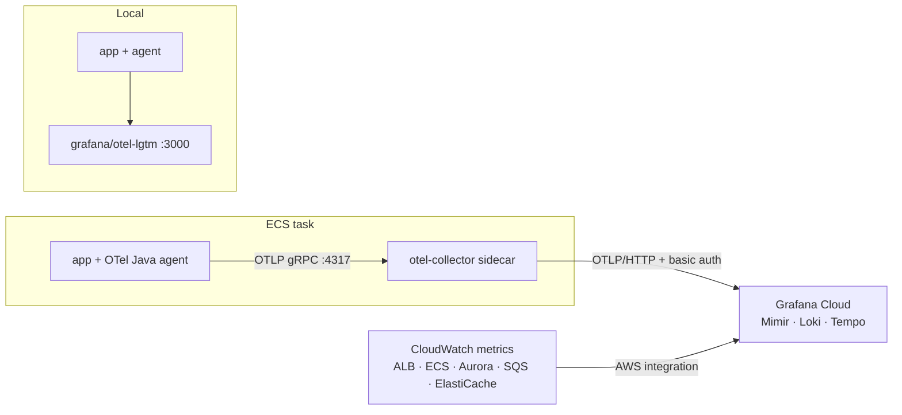

# Phase 7 — Observability

**Weeks:** 3 (local stack) → 7 (full) · **Depends on:** P2, P4 metrics, P6 · **ADRs:** 0008

## Goal
Metrics, logs and traces from every component, correlated in Grafana. Dashboards and alerts are stored as code. The SLOs reflect what users feel (delivery latency, availability).

## Why it matters (interview angle)
"How would you know it's broken before users tell you?" A trace that follows an edit through api → outbox → SNS → SQS → indexer → Bedrock, plus an SLO with a burn-rate alert, is a senior-level answer.

## Scope
- **In:**
  - OTel agent + collector sidecar.
  - The local LGTM stack.
  - Custom metrics.
  - Structured logs with trace ids.
  - Dashboards and alerts as code.
  - SLOs.
  - The Grafana Cloud CloudWatch integration.
- **Out:** on-call rotation tooling, synthetic monitoring beyond one health probe.

## Design notes

### Signals
| Signal | Source | Notes |
|---|---|---|
| HTTP/JDBC/Redis/AWS SDK spans | OTel Java agent (auto) | Exclude `/actuator/**` from tracing |
| WS frame spans | Manual: `ws.frame {type}` span per inbound frame; `ws.deliver` span on backplane receive | Link to the publisher's span via the payload `traceparent` |
| Async spans | `traceparent` in outbox → SNS attribute → SQS listener | Span links (fan-out makes parent/child misleading) |
| Custom metrics | Micrometer | See the table below. **No high-cardinality labels** (no user/channel/message ids) |
| Logs | stdout JSON (Spring structured logging, ECS format) with `trace.id`, `span.id` | ECS `awslogs` → CloudWatch **and** OTel logs → Loki; pick one in T03 |
| Infra metrics | CloudWatch via the Grafana Cloud AWS integration | ALB 5xx/TargetResponseTime, ECS CPU/memory, Aurora ACU/connections, SQS age, DLQ depth |

### Custom metrics
| Metric | Type | From |
|---|---|---|
| `ws.connections.active` | gauge | P4 |
| `ws.frames.in` / `ws.frames.out` `{type}` | counter | P4 |
| `ws.delivery.latency` | histogram (publish → socket write) | P4 |
| `ws.backplane.lag` | histogram | P4 |
| `ws.send.overflow` | counter | P4 |
| `chat.messages.sent` `{content_type}` | counter | P3 |
| `outbox.pending`, `outbox.lag.seconds` | gauge | P6 |
| `events.consumed` `{consumer, result}` | counter | P6 |
| `gen_ai.client.token.usage` `{token_type, model}` | histogram | P8 |
| `devcool.ai.time_to_first_token`, `devcool.ai.fallback` | histogram, counter | P8 |

### SLOs
| SLO | SLI | Target |
|---|---|---|
| Message delivery latency | `ws.delivery.latency` p99 | < 300 ms, 99% of 5-min windows over 28 days |
| API availability | ALB 5xx / total, excluding 4xx | 99.5% over 28 days |
| Async freshness | `outbox.lag.seconds` | < 5 s, 99% of the time |
| Ask DevCool | success (non-fallback) ratio | 95% |

Alerts are multi-window burn-rate alerts (fast 1 h/5 m at 14.4×, slow 6 h/30 m at 6×), plus: DLQ depth > 0, and outbox lag > 60 s.

## Tasks
- [ ] **P7-T01** Local: add `grafana/otel-lgtm` to compose (`--profile o11y`). Download the OTel Java agent in a Maven/Docker step. Add a `local` run config with `-javaagent` and `OTEL_EXPORTER_OTLP_ENDPOINT=http://localhost:4317`
- [ ] **P7-T02** Resource attributes: `service.name` (`devcool-api` / `devcool-worker`), `service.version` (git sha), `deployment.environment`
- [ ] **P7-T03** Logs: structured JSON with trace context. Decide on the path (CloudWatch + Loki via collector `awsfirelens`, or OTel logs exporter only) and document the choice in ADR-0008
- [ ] **P7-T04** Manual WS spans and async trace propagation (with P6-T09)
- [ ] **P7-T05** Collector config (`infra/observability/collector.yaml`): memory_limiter, resourcedetection (ecs), batch, tail_sampling (keep errors + slow + 10%), otlphttp → Grafana Cloud. Stored in SSM; the Grafana token in Secrets Manager
- [ ] **P7-T06** Sidecar container in `infra/modules/ecs-service` (essential=false, health check), and the agent in the Dockerfile (`JAVA_TOOL_OPTIONS=-javaagent:/otel/opentelemetry-javaagent.jar`)
- [ ] **P7-T07** Grafana Cloud AWS integration (IAM role for CloudWatch read) via Terraform
- [ ] **P7-T08** Dashboards as JSON in `infra/observability/dashboards/`:
  - **Overview:** RED per endpoint, WS connections, delivery p50/p99.
  - **Realtime:** frames, backplane lag, overflow, presence count.
  - **Async:** outbox, queues, DLQ, consumer results.
  - **GenAI:** tokens, cost estimate, TTFT, fallback rate.
  - **JVM/DB:** heap, GC, virtual threads, Hikari pool, Aurora ACU.
- [ ] **P7-T09** SLOs and burn-rate alerts as code (Grafana provisioning or the Terraform `grafana` provider). Contact point: email or Discord webhook
- [ ] **P7-T10** Enable the `grafana-cloud-mcp` (or `grafana-mcp`) plugin so Claude can query metrics and logs while debugging. Document example prompts in the Claude Code guide
- [ ] **P7-T11** A "debugging a slow message" walkthrough in `docs/plans/runbooks/slow-delivery.md`, going trace → logs → metrics

## Files touched
`docker/local/compose.yaml`, `Dockerfile`, `infra/observability/**`, `infra/modules/ecs-service`, `adapters/in/websocket/**` (spans), `adapters/in/messaging/**`, `application*.properties`, `.claude/settings.json`

## Test plan
- **Local:** send a message and open Tempo. One trace shows the REST/WS span, the JDBC spans and the Redis publish. The deliver span on the other node is linked.
- An edit shows a linked trace in the worker with SNS/SQS and the embedding call (after P8).
- Alert test: stop the worker, and the outbox lag alert fires within its window.

## Definition of Done
The dashboards load from repo JSON. The three signals are correlated (click from a log line to its trace and from a trace to its logs). Four SLOs have burn-rate alerts. The runbook has been walked once.

## Interview talking points
- RED vs USE; why p99 not averages; histograms vs summaries.
- Cardinality: why `channelId` is a span attribute, not a metric label.
- Tail sampling vs head sampling.
- Traces across async boundaries: links vs parent/child.
- SLOs and error budgets; burn-rate alerting vs threshold alerting.

## Risks
- Grafana Cloud free-tier limits. Watch the active series count after P4 metrics land.
- Sidecar memory on 1 GB tasks. Set `memory_limiter` and a container memory reservation.
